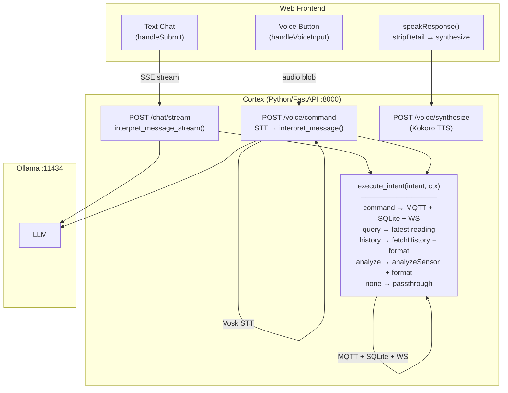

# CLAUDE.md

This file provides guidance to Claude Code (claude.ai/code) when working with code in this repository.

## Build & Development Commands

**Cortex Backend (`apps/cortex`)**
- `python -m src.main` - Run the full backend (API + MQTT + rules engine + voice)
- `uvicorn src.voice_api:app --host 0.0.0.0 --port 8000 --reload` - API server only (no MQTT/rules)

**Web (`apps/web`)**
- `npm run dev` - Vite dev server on port 5173
- `npm run build` - Production build

**Testing (`apps/cortex`)**
- `pytest tests/ -m "not e2e"` - Run unit tests (no external services needed)
- `pytest tests/ -m e2e` - Run e2e tests (requires Mosquitto + Redis + Cortex running)
- `pytest tests/ -v` - Run all tests with verbose output

**Device Tools**
- `./tools/flash.sh <device-id>` - Upload MicroPython code to ESP32 via mpremote
- `./tools/flash.sh <device-id> --erase` - Full flash with MicroPython firmware
- `./tools/flash.sh --list` - List registered devices
- `./tools/repl.sh` - Serial console monitor
- `./tools/reset.sh` - Soft reset device

**Service Management**
- `./tools/start.sh` - Start all services (Ollama, Cortex, Docker stack)
- `./tools/stop.sh` - Stop all services

**Docker**
- `docker compose up -d` - Start containerized services (Web, Redis, Mosquitto)

## Architecture

This is an IoT telemetry dashboard for ESP32 sensor monitoring with relay control.

**Data Flow:**
```
ESP32 (MicroPython) → MQTT → Cortex (Python/FastAPI) → Redis (HOT) + SQLite (COLD)
                         ↓                           → WebSocket → React Dashboard
                   Rules Engine (trend + baseline context) + Ollama LLM
                         ↓
                   MQTT Commands → ESP32
```

**Decision Context (Phase 1):**
- `DataReader` merges Redis (hot) + SQLite (cold) into unified sorted readings
- `analysis.py` computes `TrendContext` (rate-of-change via linear regression, trend direction)
- `CortexMemory` tracks per-device, per-sensor, per-hour baselines (Welford's online algorithm)
- Orchestrator caches context for 30 seconds, passes to rules engine and LLM escalation
- Rules support `trend` ("rising"/"falling"/"stable"), `time_of_day`, `forecast`, and `baseline_deviation` conditions

**Outcome Tracking (Phase 2):**
- `OutcomeTracker` correlates commands with their measurable sensor effects
- Lifecycle: `track_command` (pre-snapshot) → `handle_ack` → `check_outcomes` (at 1m/5m/10m) → score → store
- Effectiveness scored from -1.0 (made it worse) to +1.0 (strong improvement), weighted across intervals (20%/50%/30%)
- Target metric and desired direction inferred from command `reason` string keywords
- Completed outcomes persist to `cortex_outcomes` table; effectiveness summaries feed into LLM prompts

**Forecasting (Phase 3):**
- `forecaster.py` provides pure utility functions: `linear_forecast`, `will_exceed`, `will_drop_below`, `ewma_forecast`, `baseline_deviation`
- Linear forecast projects sensor values using rate-of-change from linear regression
- EWMA smoothing for noisy sensors (humidity) before forecasting
- Rules engine supports `forecast` ("will_exceed"/"will_drop_below") with `forecast_threshold` and `forecast_within_minutes`
- Rules engine supports `baseline_deviation` to trigger on abnormal values (N standard deviations from hourly baseline)
- Forecast data (predicted values at 10m/15m, EWMA, rate) included in context cache and LLM prompts

**Voice & Chat Architecture:**

Both text chat and voice commands funnel through a shared `execute_intent()` function, ensuring all intents are handled identically.


```mermaid
flowchart TB
    subgraph Frontend["Web Frontend"]
        TextChat["Text Chat<br/>(handleSubmit)"]
        VoiceBtn["Voice Button<br/>(handleVoiceInput)"]
        TTS["speakResponse()<br/>stripDetail → synthesize"]
    end

    subgraph Cortex["Cortex (Python/FastAPI :8000)"]
        ChatStream["POST /chat/stream<br/>interpret_message_stream()"]
        VoiceCmd["POST /voice/command<br/>STT → interpret_message()"]
        Synth["POST /voice/synthesize<br/>(Kokoro TTS)"]

        Executor["execute_intent(intent, ctx)<br/>───────────────<br/>command → MQTT + SQLite + WS<br/>query → latest reading<br/>history → fetchHistory + format<br/>analyze → analyzeSensor + format<br/>none → passthrough"]
    end

    subgraph Ollama["Ollama :11434"]
        LLM["LLM"]
    end

    TextChat -->|SSE stream| ChatStream
    VoiceBtn -->|audio blob| VoiceCmd
    ChatStream --> LLM
    VoiceCmd -->|Vosk STT| VoiceCmd
    VoiceCmd --> LLM
    ChatStream --> Executor
    VoiceCmd --> Executor
    Executor -->|MQTT + SQLite + WS| Executor
    TTS --> Synth
```

**Monorepo Structure:**
- `apps/cortex` - Python/FastAPI unified backend (REST API, WebSocket, MQTT, rules engine, voice, LLM)
- `apps/web` - React/Vite dashboard with Chart.js visualizations
- `device/` - MicroPython code for ESP32 sensors
- `tools/` - Device management shell scripts

**Storage Strategy:**
- **Redis** - Raw readings with 48-hour TTL (HOT data)
- **SQLite** - Aggregated historical data (COLD data)
- `DataReader` merges both sources for queries and decision context
- `cortex_baselines` table stores learned per-hour sensor baselines
- `cortex_outcomes` table stores command effectiveness scores (Phase 2)

**MQTT Topics:**
- `home/{location}/{deviceId}/telemetry` - Sensor readings (Device → Server)
- `home/{location}/{deviceId}/command` - Commands to device (Server → Device)
- `home/{location}/{deviceId}/ack` - Command acknowledgments (Device → Server)
- `home/_registry/{deviceId}/birth` - Device registration (Device → Server)
- `home/_registry/{deviceId}/will` - Device offline (LWT, Broker → Server)

## API Endpoints

**Telemetry & Analysis**
- `GET /api/latest` - Current sensor reading
- `GET /api/history` - Historical data with optional bucketing (`sinceMs`, `untilMs`, `bucketMs`, `deviceId`)
- `GET /api/outcomes` - Command effectiveness records (`deviceId`, `target`, `sinceMs`, `limit`)

**Devices**
- `GET /api/devices` - Registered devices
- `GET /api/devices/:id` - Single device
- `GET /api/devices/:id/actuators` - Device actuators
- `PUT /api/devices/order` - Reorder devices (`{order: string[]}` of device IDs)

**Relays (per-device)**
- `GET /api/devices/:deviceId/relays` - Device relay states
- `GET /api/devices/:deviceId/relays/:id` - Single relay
- `POST /api/devices/:deviceId/relays/:id` - Control relay state (`{state: boolean}`)
- `PATCH /api/devices/:deviceId/relays/:id` - Update relay name
- `DELETE /api/devices/:deviceId/relays/:id` - Delete relay

**Commands & Events**
- `GET /api/commands` - Command history
- `GET /api/events` - Device event log

**Chat (NLP)**
- `POST /api/chat` - Process natural language command
- `POST /api/chat/stream` - Streaming chat response (SSE)
- `GET /api/chat/health` - Ollama availability check

**Voice (Direct)**
- `POST /api/voice/transcribe` - Audio → Text (Vosk STT)
- `POST /api/voice/synthesize` - Text → Audio (Kokoro TTS)
- `POST /api/voice/command` - Full STT → LLM → execute_intent pipeline

**WebSocket**
- WebSocket at `/ws` broadcasts:
  - `{type: "latest", data: ...}` - Sensor updates
  - `{type: "relays", data: ...}` - Relay state changes
  - `{type: "devices", data: ...}` - Device registry updates
  - `{type: "commands", data: ...}` - Command history
  - `{type: "events", data: ...}` - Device events

## Key Files

**Cortex Backend:**
- `apps/cortex/src/main.py` - Entry point: starts API server, MQTT, decision engine
- `apps/cortex/src/voice_api.py` - Unified FastAPI app (lifespan, routes, WebSocket, health)
- `apps/cortex/src/config.py` - Environment variable configuration
- `apps/cortex/src/services/sqlite_client.py` - SQLite schema, migrations, all CRUD queries
- `apps/cortex/src/services/redis_client.py` - Redis client with 48hr TTL storage
- `apps/cortex/src/services/mqtt_client.py` - MQTT subscriber/publisher with storage + broadcast
- `apps/cortex/src/services/websocket_server.py` - WebSocket server + broadcast functions
- `apps/cortex/src/services/ollama_client.py` - Ollama LLM client (chat intents + decision engine)
- `apps/cortex/src/services/intent_executor.py` - Shared intent executor for chat + voice routes
- `apps/cortex/src/services/analysis.py` - Sensor data analysis, trend context, rate-of-change
- `apps/cortex/src/services/data_reader.py` - Unified Redis+SQLite telemetry read layer
- `apps/cortex/src/services/cortex_memory.py` - Per-device hourly baseline tracking (Welford's algorithm)
- `apps/cortex/src/services/background_jobs.py` - Aggregation (Redis→SQLite) + command expiration
- `apps/cortex/src/services/decision_engine.py` - Rules engine with trend/time-of-day/forecast/baseline-deviation conditions + LLM escalation
- `apps/cortex/src/services/forecaster.py` - Sensor forecasting: linear projection, EWMA smoothing, breach prediction, baseline deviation (Phase 3)
- `apps/cortex/src/services/outcome_tracker.py` - Command outcome tracking, effectiveness scoring (Phase 2)
- `apps/cortex/src/services/voice_service.py` - STT (Vosk) + TTS (Kokoro)
- `apps/cortex/src/api/` - REST route handlers (telemetry, devices, relays, commands, events, chat, voice)
- `apps/cortex/config/rules.yaml` - Automation rules (threshold, trend, forecast, baseline deviation)
- `apps/cortex/tests/conftest.py` - Test fixtures (sqlite_db, mock_redis, telemetry_factory)
- `apps/cortex/tests/test_analysis.py` - Unit tests: stats, trends, rate-of-change
- `apps/cortex/tests/test_cortex_memory.py` - Unit tests: baseline tracking (Welford's)
- `apps/cortex/tests/test_data_reader.py` - Unit tests: Redis+SQLite merge layer
- `apps/cortex/tests/test_decision_engine.py` - Unit tests: rules, trend/time-of-day/forecast/baseline conditions
- `apps/cortex/tests/test_forecaster.py` - Unit tests: linear forecast, EWMA, breach detection, baseline deviation
- `apps/cortex/tests/test_outcome_tracker.py` - Unit tests: outcome tracking, scoring, lifecycle
- `apps/cortex/tests/test_e2e_flow.py` - E2E tests: MQTT→API→Storage flow (requires running services)

**Web:**
- `apps/web/src/App.tsx` - Main dashboard component
- `apps/web/src/hooks/useWebSocket.ts` - WebSocket connection with device/event/command handlers
- `apps/web/src/hooks/useRelays.ts` - Relay state management with offline detection
- `apps/web/src/hooks/useOptimisticToggle.ts` - Toggle with ack timeout handling
- `apps/web/src/hooks/useHistory.ts` - History fetching with deviceId filter
- `apps/web/src/api.ts` - REST + WebSocket client functions
- `apps/web/src/components/` - UI components (SensorCard, RelayControl, ChatInput, ActivityCenter)

**Device:**
- `device/main.py` - Sensor loop + command handling
- `device/boot.py` - WiFi connection on startup
- `device/secrets.py` - Auto-generated credentials (gitignored)
- `device/lib/home_hub.py` - HomeHubClient for standardized MQTT messaging
- `device/registry.json` - Device registry (gitignored)

## Environment Variables

**Cortex:**
- `MQTT_HOST`, `MQTT_PORT` - MQTT broker config
- `REDIS_URL` - Redis connection
- `SQLITE_PATH`, `SQLITE_JOURNAL_MODE` - SQLite config
- `OLLAMA_URL`, `OLLAMA_MODEL` - Local LLM config
- `HTTP_PORT` - FastAPI server port (default: 8000)
- `RULES_PATH` - Path to rules.yaml
- `VOSK_MODEL_PATH` - Vosk STT model path
- `KOKORO_MODEL_PATH`, `KOKORO_VOICES_PATH` - Kokoro TTS model paths
- `KOKORO_VOICE`, `KOKORO_SPEED`, `KOKORO_LANG` - Kokoro TTS settings

**Web:**
- `VITE_API_PROXY_TARGET` - API proxy target (default: http://localhost:8000)

## Web UI Architecture

**Styling Stack:**
- Tailwind CSS v4 with `@import "tailwindcss"` syntax
- Custom theme variables in `@theme { }` block (e.g., `--color-panel`)
- Custom component classes in `@layer components { }` (glass-card, circle, tempCircle, etc.)
- CSS container queries used (`[container-type:inline-size]`) for responsive gauges

**Layout Structure (App.tsx):**
```
┌─────────────────────────────────────────────────────────────┐
│  Activity toggle (fixed top-right)     Drawer (340px, z-30) │
├─────────────────────────────────────── ┌──────────────────┐ │
│  Main content (centered, flex-wrap)    │ Recent Activity   │ │
│  ┌──────────────┐ ┌──────────────┐    │ (slide-out right) │ │
│  │ DevicePanel   │ │ DevicePanel   │    │                  │ │
│  │ (drag-sort)   │ │ (drag-sort)   │    └──────────────────┘ │
│  │ - Drag handle │ │              │                          │
│  │ - Sensors     │ │              │                          │
│  │ - Actuators   │ │              │                          │
│  └──────────────┘ └──────────────┘                          │
├─────────────────────────────────────────────────────────────┤
│  ChatInput (fixed bottom, backdrop-blur)                    │
└─────────────────────────────────────────────────────────────┘
```

**Key Component Files:**
- `apps/web/src/styles.css` - Global styles, Tailwind config, custom components
- `apps/web/src/components/SensorCard.tsx` - Combined temp/humidity gauges with charts
- `apps/web/src/components/DevicePanel.tsx` - Per-device panel with drag-and-drop (via @dnd-kit)
- `apps/web/src/components/ChatInput.tsx` - AI assistant input
- `apps/web/src/components/ActivityCenter.tsx` - Activity feed (slide-out drawer)

**Drag-and-Drop Notes:**
- Uses `@dnd-kit/core` + `@dnd-kit/sortable` for panel reordering
- `DragOverlay` renders the dragged panel in a portal (preserves `backdrop-blur`)
- No CSS transforms on items — live array reorder via `onDragOver` instead
- Order persisted to SQLite `display_order` column via `PUT /api/devices/order`
- Grip handle in device header initiates drag; relay toggles and buttons unaffected

**Responsive Design Notes:**
- Mobile: `px-3` padding, `min-w-[390px]` panels; Desktop: `px-5`
- Gauge circles use `clamp()` for fluid sizing: `--size: clamp(140px, 22cqw, 200px)`
- Charts use `h-[clamp(140px,20vh,200px)]` for fluid height
- Pinch zoom disabled via viewport meta (`user-scalable=no`)

## Chat & Voice Response Format

**`<detail>` Tag Pattern:**
Chat responses for `analyze` and `history` intents use `<detail>` tags to separate display-only content from TTS-spoken content:
```
intent.reply              ← spoken by TTS
<detail>
📊 detailed data...       ← display only (stripped by TTS)
</detail>
intent.summary            ← spoken by TTS
```

- `stripDetail()` in ChatInput.tsx removes `<detail>...</detail>` blocks before passing text to TTS
- `formatMessage()` strips the tag markers for display rendering
- The LLM produces `summary` (1-3 sentence spoken closing) for `history` and `analyze` intents
- TTS text is cleaned via `_clean_text_for_tts()` in voice_service.py (numbers, times, currency, percentages, ordinals, emojis, markdown → spoken English)
- Long TTS text is chunked via `_split_into_chunks()` to stay within Kokoro's 510 phoneme limit

## Claude Skills

Project-specific skills in `.claude/skills/`:

| Skill | Description |
|-------|-------------|
| `/commit` | Create git commits with conventional commit messages |
| `/pr` | Create pull requests with formatted title and description |
| `/release` | Create git tags and GitHub releases with auto-generated notes |
| `/docs` | Update README.md and CLAUDE.md to reflect code changes |

## Preferences
- You ALWAYS work on plans in /docs, not the global ~/.claude/plans directory. Your plan files must have descriptive names.
- prefer `docker compose ...` over `docker-compose ...`
- Use the latest installation instructions for libraries and packages. Ensure compatibility with system dependencies. Always prefer latest versions.
- All code additions must include tests. Unit tests go in `apps/cortex/tests/` using pytest. Run `pytest tests/ -m "not e2e"` to verify before committing.
- Tests must cover both happy paths and edge cases (empty inputs, boundary values, error conditions).
- Use the shared fixtures from `conftest.py` (`sqlite_db`, `mock_redis`, `telemetry_factory`) — don't reinvent them.
- When modifying existing code, run the full unit test suite first to establish a baseline, then again after changes to catch regressions.
- E2E tests (`@pytest.mark.e2e`) are for integration scenarios that require running services. Keep unit tests fast and isolated with mocks.
- Name test classes `Test<Module>` and methods `test_<behavior_under_test>`. Group related tests in the same class.

## Autonomous Plan Execution
When working through a multi-phase plan (e.g., `docs/mycelium-cortex-plan.md`), you may continue executing subsequent phases without waiting for human approval **provided all of the following are true**:
1. All unit tests pass (`pytest tests/ -m "not e2e"`) with zero regressions
2. Documentation (README.md, CLAUDE.md) has been audited and updated via `/docs`
3. You are not deviating from the approved plan — no architectural changes, no new dependencies, no scope creep

If any of these conditions fail, stop and ask before proceeding.

## Post-Implementation Workflow
After completing a plan or significant implementation work, run `/docs` to update README.md and CLAUDE.md. This ensures documentation stays in sync with code changes.