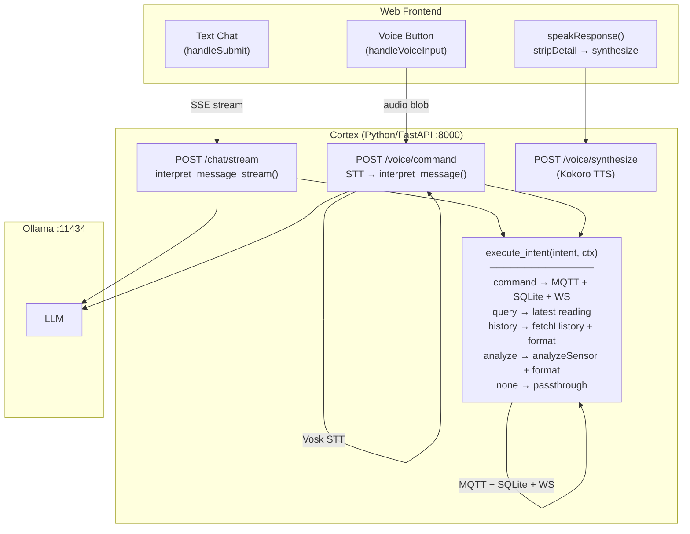

# CLAUDE.md

This file provides guidance to Claude Code (claude.ai/code) when working with code in this repository.

## Build & Development Commands

**Cortex Backend (`apps/cortex`)**
- `python -m src.main` - Run the full backend (API + MQTT + rules engine + voice)
- `uvicorn src.voice_api:app --host 0.0.0.0 --port 8000 --reload` - API server only (no MQTT/rules)

**Web (`apps/web`)**
- `npm run dev` - Vite dev server on port 5173
- `npm run build` - Production build

**Testing (`apps/cortex`)**
- `pytest tests/ -m "not e2e"` - Run unit tests (no external services needed)
- `pytest tests/ -m e2e` - Run e2e tests (requires Mosquitto + Redis + Cortex running)
- `pytest tests/ -v` - Run all tests with verbose output

**Simulation (`apps/cortex`)**
- `python -m simulations.grow_tent` - Run standard grow tent simulation (3h, 30s steps)
- `python -m simulations.grow_tent --adaptive` - Run adaptive learning simulation (Phase 1 → gap analysis → Phase 2)
- `python -m simulations.grow_tent --adaptive --suboptimal` - Adaptive with deliberately bad rules (best demo)
- `python -m simulations.grow_tent --multi-day --suboptimal -v` - Multi-day simulation (72h, 12h checkpoints, periodic Rule Advisor)
- `python -m simulations.grow_tent --duration 360 --start-hour 6` - Custom duration/start
- `pytest tests/test_simulation_grow_tent.py tests/test_simulation_adaptive.py tests/test_simulation_multi_day.py -v` - Simulation tests

**Device Tools**
- `./tools/flash.sh <device-id>` - Upload MicroPython code to ESP32 via mpremote
- `./tools/flash.sh <device-id> --erase` - Full flash with MicroPython firmware
- `./tools/flash.sh --list` - List registered devices
- `./tools/repl.sh` - Serial console monitor
- `./tools/reset.sh` - Soft reset device

**Service Management**
- `./tools/start.sh` - Start all services (Ollama, Cortex, Docker stack)
- `./tools/stop.sh` - Stop all services

**Docker**
- `docker compose up -d` - Start containerized services (Web, Redis, Mosquitto)

## Architecture

This is an IoT telemetry dashboard for ESP32 sensor monitoring with relay control.

**Data Flow:**
```
ESP32 (MicroPython) → MQTT → Cortex (Python/FastAPI) → Redis (HOT) + SQLite (COLD)
                         ↓                           → WebSocket → React Dashboard
                   Rules Engine (trend + baseline context) + Ollama LLM
                         ↓
                   MQTT Commands → ESP32
```

**Decision Context (Phase 1):**
- `DataReader` merges Redis (hot) + SQLite (cold) into unified sorted readings
- `analysis.py` computes `TrendContext` (rate-of-change via linear regression, trend direction)
- `CortexMemory` tracks per-device, per-sensor, per-hour baselines (Welford's online algorithm)
- Orchestrator caches context for 30 seconds, passes to rules engine and LLM escalation
- Rules support `trend` ("rising"/"falling"/"stable"), `time_of_day`, `forecast`, and `baseline_deviation` conditions

**Outcome Tracking (Phase 2):**
- `OutcomeTracker` correlates commands with their measurable sensor effects
- Lifecycle: `track_command` (pre-snapshot) → `handle_ack` → `check_outcomes` (at 1m/5m/10m) → score → store
- Effectiveness scored from -1.0 (made it worse) to +1.0 (strong improvement), weighted across intervals (20%/50%/30%)
- Target metric and desired direction inferred from: (1) command `reason` string keywords, (2) metric-aware ON/OFF mapping (`ON_DIRECTION_BY_METRIC`), (3) legacy fallback
- Completed outcomes persist to `cortex_outcomes` table; effectiveness summaries feed into LLM prompts

**Forecasting (Phase 3):**
- `forecaster.py` provides pure utility functions: `linear_forecast`, `will_exceed`, `will_drop_below`, `ewma_forecast`, `baseline_deviation`
- Linear forecast projects sensor values using rate-of-change from linear regression
- EWMA smoothing for noisy sensors (humidity) before forecasting
- Rules engine supports `forecast` ("will_exceed"/"will_drop_below") with `forecast_threshold` and `forecast_within_minutes`
- Rules engine supports `baseline_deviation` to trigger on abnormal values (N standard deviations from hourly baseline)
- Forecast data (predicted values at 10m/15m, EWMA, rate) included in context cache and LLM prompts

**Adaptive Learning (Phase 4):**
- `RuleAdvisor` periodically analyzes outcome data, baselines, and observations every 6 hours
- Uses LLM to suggest threshold/timing adjustments with confidence scores
- High-confidence threshold adjustments (>= 0.8) auto-apply to in-memory rules
- Lower-confidence or non-threshold suggestions require manual approval via API
- Suggestions stored in `cortex_suggestions` table with status tracking (pending/applied/rejected)
- Applied suggestions persist to SQLite via `update_rule_condition_field()` — surviving restarts
- Background job runs via `start_rule_advisor_job()` using `asyncio.to_thread()` for LLM calls
- Suggestions broadcast to Activity Center via WebSocket (`{type: "suggestions"}`) for real-time approve/reject
- **Effectiveness Guard**: Rules with high effectiveness (avg >0.5, ≥3 outcomes) are protected from "unreachable", "too-sensitive", and "stale forecast" suggestions — prevents the advisor from breaking rules that are already working well
- **Too-sensitive cap**: Threshold adjustments from `_detect_too_sensitive()` are capped at ±25% of the original value (`TOO_SENSITIVE_MAX_CHANGE_PCT`), preventing drastic jumps like 100→811
- **Confidence filtering**: Simulation runner only auto-applies suggestions with confidence ≥ `AUTO_APPLY_CONFIDENCE` (0.8), matching production behavior

**Multi-Device Coordination (Phase 5):**
- `Coordinator` provides cross-device state queries via `WebSocketServer._latest_by_device` and `SqliteClient` device registry
- Rules support `scope` condition field: `"self"` (default), `"any"`, `"all"`, or `"<device_id>"` to read from multiple devices
- Rules support `target_scope` action field: `"self"` (default), `"all"`, or `"<device_id>"` to send commands to multiple devices
- Scope `any` picks extreme value most likely to pass (e.g., `max` for `>` operator); `all` picks least likely (e.g., `min` for `>`)
- Cross-device rules use shared `_cross:{sensor}:{rule_name}` state key for cooldown/duration tracking
- Backward compatible — all defaults are `"self"`, existing rules work identically

**Voice & Chat Architecture:**

Both text chat and voice commands funnel through a shared `execute_intent()` function, ensuring all intents are handled identically.


```mermaid
flowchart TB
    subgraph Frontend["Web Frontend"]
        TextChat["Text Chat<br/>(handleSubmit)"]
        VoiceBtn["Voice Button<br/>(handleVoiceInput)"]
        TTS["speakResponse()<br/>stripDetail → synthesize"]
    end

    subgraph Cortex["Cortex (Python/FastAPI :8000)"]
        ChatStream["POST /chat/stream<br/>interpret_message_stream()"]
        VoiceCmd["POST /voice/command<br/>STT → interpret_message()"]
        Synth["POST /voice/synthesize<br/>(Kokoro TTS)"]

        Executor["execute_intent(intent, ctx)<br/>───────────────<br/>command → MQTT + SQLite + WS<br/>query → latest reading<br/>history → fetchHistory + format<br/>analyze → analyzeSensor + format<br/>none → passthrough"]
    end

    subgraph Ollama["Ollama :11434"]
        LLM["LLM"]
    end

    TextChat -->|SSE stream| ChatStream
    VoiceBtn -->|audio blob| VoiceCmd
    ChatStream --> LLM
    VoiceCmd -->|Vosk STT| VoiceCmd
    VoiceCmd --> LLM
    ChatStream --> Executor
    VoiceCmd --> Executor
    Executor -->|MQTT + SQLite + WS| Executor
    TTS --> Synth
```

**Monorepo Structure:**
- `apps/cortex` - Python/FastAPI unified backend (REST API, WebSocket, MQTT, rules engine, voice, LLM)
- `apps/cortex/simulations` - Grow tent simulation framework (physics engine, runner, charts, adaptive learning)
- `apps/web` - React/Vite dashboard with Chart.js visualizations
- `device/` - MicroPython code for ESP32 sensors
- `tools/` - Device management shell scripts

**Generic Sensor Pipeline:**
- The entire telemetry pipeline is sensor-type agnostic — no hardcoded temp/humidity assumptions
- MQTT ingestion loops ALL numeric readings from device payloads into `readings: dict[str, float]`
- `sensor_meta.py` provides `guess_sensor_type()`, `sensor_unit()`, `sensor_label()` for sensor ID resolution
- `sensor_values` EAV table stores one row per sensor per timestamp (replaces fixed-column `sensor_readings`)
- Frontend renders sensors dynamically from device capabilities (special gauges for temp/humidity, generic readouts for others)

**Storage Strategy:**
- **Redis** - Raw readings with 48-hour TTL (HOT data), stored as `{readings: {sensor_id: value}, ...}`
- **SQLite** - Aggregated historical data (COLD data) in `sensor_values` EAV table
- `DataReader` merges both sources into `MergedReading(ts, readings: dict[str, float], device_id)` for queries and decision context
- `cortex_rules` table is the single source of truth for automation rules (seeded from YAML on first run)
- `cortex_baselines` table stores learned per-hour sensor baselines
- `cortex_outcomes` table stores command effectiveness scores (Phase 2)
- `cortex_suggestions` table stores rule adjustment suggestions from the Rule Advisor (Phase 4)

**MQTT Topics:**
- `home/{location}/{deviceId}/telemetry` - Sensor readings (Device → Server)
- `home/{location}/{deviceId}/command` - Commands to device (Server → Device)
- `home/{location}/{deviceId}/ack` - Command acknowledgments (Device → Server)
- `home/_registry/{deviceId}/birth` - Device registration (Device → Server)
- `home/_registry/{deviceId}/will` - Device offline (LWT, Broker → Server)

## API Endpoints

**Telemetry & Analysis**
- `GET /api/latest` - Current sensor reading
- `GET /api/history` - Historical data with optional bucketing (`sinceMs`, `untilMs`, `bucketMs`, `deviceId`)
- `GET /api/outcomes` - Command effectiveness records (`deviceId`, `target`, `sinceMs`, `limit`)

**Devices**
- `GET /api/devices` - Registered devices
- `GET /api/devices/:id` - Single device
- `GET /api/devices/:id/actuators` - Device actuators
- `PUT /api/devices/order` - Reorder devices (`{order: string[]}` of device IDs)

**Relays (per-device)**
- `GET /api/devices/:deviceId/relays` - Device relay states
- `GET /api/devices/:deviceId/relays/:id` - Single relay
- `POST /api/devices/:deviceId/relays/:id` - Control relay state (`{state: boolean}`)
- `PATCH /api/devices/:deviceId/relays/:id` - Update relay name
- `DELETE /api/devices/:deviceId/relays/:id` - Delete relay

**Commands & Events**
- `GET /api/commands` - Command history
- `GET /api/events` - Device event log

**Observations**
- `POST /api/observations` - Log human observation (`{deviceId, category, notes?}`)

**Cortex Intelligence (Phase 4+6+7)**
- `GET /api/cortex/status` - System intelligence overview (outcomes, baselines, suggestions counts)
- `GET /api/cortex/baselines/:deviceId` - Learned hourly baselines for a device
- `GET /api/cortex/adjustments` - Rule adjustment suggestions (`?status=pending|applied|rejected`)
- `POST /api/cortex/adjustments/:id` - Approve or reject a suggestion (`{action: "approve"|"reject"}`)
- `GET /api/cortex/rules` - All rules from SQLite with enabled/modified/source state
- `POST /api/cortex/rules` - Create a new rule (`{name, description, condition, action, enabled}`)
- `PUT /api/cortex/rules/{id}` - Update an existing rule by UUID
- `PATCH /api/cortex/rules/{id}` - Toggle rule enabled state (`{enabled: boolean}`)
- `DELETE /api/cortex/rules/{id}` - Delete a rule (cascades to suggestions)

**Chat (NLP)**
- `POST /api/chat` - Process natural language command
- `POST /api/chat/stream` - Streaming chat response (SSE)
- `GET /api/chat/health` - Ollama availability check

**Voice (Direct)**
- `POST /api/voice/transcribe` - Audio → Text (Vosk STT)
- `POST /api/voice/synthesize` - Text → Audio (Kokoro TTS)
- `POST /api/voice/command` - Full STT → LLM → execute_intent pipeline

**WebSocket**
- WebSocket at `/ws` broadcasts:
  - `{type: "latest", data: ...}` - Sensor updates
  - `{type: "relays", data: ...}` - Relay state changes
  - `{type: "devices", data: ...}` - Device registry updates
  - `{type: "commands", data: ...}` - Command history
  - `{type: "events", data: ...}` - Device events
  - `{type: "suggestions", data: ...}` - Rule adjustment suggestions (Phase 4)
  - `{type: "rules", data: ...}` - Rule states (enabled/disabled/modified) (Phase 6)

## Key Files

**Cortex Backend:**
- `apps/cortex/src/main.py` - Entry point: starts API server, MQTT, decision engine
- `apps/cortex/src/voice_api.py` - Unified FastAPI app (lifespan, routes, WebSocket, health)
- `apps/cortex/src/config.py` - Environment variable configuration
- `apps/cortex/src/services/sqlite_client.py` - SQLite schema, migrations, all CRUD queries (includes `sensor_values` EAV table)
- `apps/cortex/src/services/redis_client.py` - Redis client with 48hr TTL storage (`RedisReading.readings: dict`)
- `apps/cortex/src/services/mqtt_client.py` - MQTT subscriber/publisher with generic sensor ingestion + broadcast
- `apps/cortex/src/services/sensor_meta.py` - Sensor type resolution: `guess_sensor_type()`, `sensor_unit()`, `sensor_label()`
- `apps/cortex/src/services/websocket_server.py` - WebSocket server + broadcast functions
- `apps/cortex/src/services/ollama_client.py` - Ollama LLM client (chat intents + decision engine)
- `apps/cortex/src/services/intent_executor.py` - Shared intent executor for chat + voice routes
- `apps/cortex/src/services/analysis.py` - Sensor data analysis, trend context, rate-of-change
- `apps/cortex/src/services/data_reader.py` - Unified Redis+SQLite telemetry read layer
- `apps/cortex/src/services/cortex_memory.py` - Per-device hourly baseline tracking (Welford's algorithm)
- `apps/cortex/src/services/background_jobs.py` - Aggregation (Redis→SQLite) + command expiration + rule advisor + suggestion cleanup periodic jobs
- `apps/cortex/src/services/decision_engine.py` - Rules engine with trend/time-of-day/forecast/baseline-deviation/cross-device conditions + LLM escalation
- `apps/cortex/src/services/coordinator.py` - Cross-device state provider for multi-device rule evaluation (Phase 5)
- `apps/cortex/src/services/forecaster.py` - Sensor forecasting: linear projection, EWMA smoothing, breach prediction, baseline deviation (Phase 3)
- `apps/cortex/src/services/outcome_tracker.py` - Command outcome tracking, effectiveness scoring (Phase 2)
- `apps/cortex/src/services/rule_advisor.py` - Rule Advisor: LLM-powered rule analysis, auto-apply, approve/reject (Phase 4)
- `apps/cortex/src/services/voice_service.py` - STT (Vosk) + TTS (Kokoro)
- `apps/cortex/src/api/` - REST route handlers (telemetry, devices, relays, commands, events, observations, cortex, chat, voice)
- `apps/cortex/config/rules.yaml` - Seed file for automation rules (imported to SQLite on first run, then LLM config only)
- `apps/cortex/tests/conftest.py` - Test fixtures (sqlite_db, mock_redis, telemetry_factory)
- `apps/cortex/tests/test_analysis.py` - Unit tests: stats, trends, rate-of-change
- `apps/cortex/tests/test_cortex_memory.py` - Unit tests: baseline tracking (Welford's)
- `apps/cortex/tests/test_data_reader.py` - Unit tests: Redis+SQLite merge layer
- `apps/cortex/tests/test_decision_engine.py` - Unit tests: rules, trend/time-of-day/forecast/baseline conditions
- `apps/cortex/tests/test_forecaster.py` - Unit tests: linear forecast, EWMA, breach detection, baseline deviation
- `apps/cortex/tests/test_observations.py` - Unit tests: observation endpoint validation, storage, broadcast
- `apps/cortex/tests/test_outcome_tracker.py` - Unit tests: outcome tracking, scoring, lifecycle, metric-aware direction inference
- `apps/cortex/tests/test_rule_advisor.py` - Unit tests: rule advisor analysis, auto-apply, approve/reject, LLM parsing
- `apps/cortex/tests/test_cortex_api.py` - Unit tests: /api/cortex routes (status, baselines, adjustments, rules CRUD)
- `apps/cortex/tests/test_rules_crud.py` - Unit tests: SQLite rules CRUD, seed from YAML, engine loading from SQLite
- `apps/cortex/tests/test_suggestion_cleanup.py` - Unit tests: rejected suggestion purge logic and cleanup job
- `apps/cortex/tests/test_coordinator.py` - Unit tests: cross-device state provider (Phase 5)
- `apps/cortex/tests/test_cross_device_rules.py` - Unit tests: scope/target_scope rule evaluation, YAML loading, state tracking (Phase 5)
- `apps/cortex/tests/test_sensor_values.py` - Unit tests: sensor_values EAV table CRUD, bucketing, migration
- `apps/cortex/tests/test_sensor_meta.py` - Unit tests: sensor type guessing, unit/label resolution
- `apps/cortex/tests/test_e2e_flow.py` - E2E tests: MQTT→API→Storage flow (requires running services)

**Simulation Framework:**
- `apps/cortex/simulations/__init__.py` - Package init
- `apps/cortex/simulations/grow_tent.py` - CLI entry point with `--adaptive`, `--multi-day`, and `--suboptimal` flags
- `apps/cortex/simulations/environment.py` - Physics engine: temperature, humidity, soil moisture, light with actuator effects, cross-variable correlations, and day/night ambient schedule (`default_ambient_schedule()`)
- `apps/cortex/simulations/runner.py` - SimulationRunner (time-stepping loop with DecisionEngine), outcome tracking, baseline learning, `run_adaptive()` for before/after comparison, `run_multi_day()` for continuous multi-day simulation with periodic Rule Advisor checkpoints and convergence detection
- `apps/cortex/simulations/charts.py` - Matplotlib visualization: 4-panel timeseries (`plot_simulation`), adaptive comparison charts (`plot_adaptive`), and multi-day timeline with effectiveness trajectory (`plot_multi_day`)
- `apps/cortex/simulations/scenarios/grow_tent_rules.py` - Well-tuned grow tent rule set (12 rules)
- `apps/cortex/simulations/scenarios/suboptimal_rules.py` - Deliberately bad thresholds for adaptive learning demo
- `apps/cortex/tests/test_simulation_grow_tent.py` - Tests: physics engine, actuator effects, cross-variable correlations, full simulation, chart output
- `apps/cortex/tests/test_simulation_adaptive.py` - Tests: outcome tracking, baseline learning, adaptive loop, suboptimal rule improvement, chart generation
- `apps/cortex/tests/test_simulation_multi_day.py` - Tests: ambient schedule, multi-day runner, adaptive learning convergence, multi-day chart generation

**Web:**
- `apps/web/src/App.tsx` - App shell with routing, shared state, header navigation
- `apps/web/src/pages/Dashboard.tsx` - Main dashboard with device panels and drag-and-drop
- `apps/web/src/pages/NerveCenter.tsx` - Nerve Center page (rules, suggestions, baselines, system health)
- `apps/web/src/components/NerveCenterOverview.tsx` - System health stats and advisor controls
- `apps/web/src/components/NerveCenterRules.tsx` - Rule card grid with CRUD (create/edit/delete), category grouping, toggle
- `apps/web/src/components/RuleFormModal.tsx` - Centered modal form for creating/editing rules
- `apps/web/src/components/NerveCenterSuggestions.tsx` - Suggestion management with approve/reject
- `apps/web/src/components/NerveCenterBaselines.tsx` - 24h baseline charts per device (Chart.js)
- `apps/web/src/hooks/useWebSocket.ts` - WebSocket connection with device/event/command/rules handlers
- `apps/web/src/hooks/useRelays.ts` - Relay state management with offline detection
- `apps/web/src/hooks/useOptimisticToggle.ts` - Toggle with ack timeout handling
- `apps/web/src/hooks/useHistory.ts` - History fetching with deviceId filter
- `apps/web/src/api.ts` - REST + WebSocket client functions
- `apps/web/src/components/` - UI components (SensorCard, RelayControl, ChatInput, ActivityCenter, ObservationForm)

**Device:**
- `device/main.py` - Sensor loop + command handling
- `device/boot.py` - WiFi connection on startup
- `device/secrets.py` - Auto-generated credentials (gitignored)
- `device/lib/home_hub.py` - HomeHubClient for standardized MQTT messaging
- `device/registry.json` - Device registry (gitignored)

## Environment Variables

**Cortex:**
- `MQTT_HOST`, `MQTT_PORT` - MQTT broker config
- `REDIS_URL` - Redis connection
- `SQLITE_PATH`, `SQLITE_JOURNAL_MODE` - SQLite config
- `OLLAMA_URL`, `OLLAMA_MODEL` - Local LLM config
- `HTTP_PORT` - FastAPI server port (default: 8000)
- `RULES_PATH` - Path to rules.yaml
- `VOSK_MODEL_PATH` - Vosk STT model path
- `KOKORO_MODEL_PATH`, `KOKORO_VOICES_PATH` - Kokoro TTS model paths
- `KOKORO_VOICE`, `KOKORO_SPEED`, `KOKORO_LANG` - Kokoro TTS settings

**Web:**
- `VITE_API_PROXY_TARGET` - API proxy target (default: http://localhost:8000)

## Web UI Architecture

**Styling Stack:**
- Tailwind CSS v4 with `@import "tailwindcss"` syntax
- Custom theme variables in `@theme { }` block (e.g., `--color-panel`)
- Custom component classes in `@layer components { }` (glass-card, circle, tempCircle, etc.)
- CSS container queries used (`[container-type:inline-size]`) for responsive gauges

**Routing (react-router-dom):**
- `/` — Dashboard (device panels, drag-and-drop, sensor cards)
- `/nerve-center` — Nerve Center (rules, suggestions, baselines, system health)

**Layout Structure (App.tsx shell):**
```
┌─────────────────────────────────────────────────────────────┐
│  Header: [Nerve Center btn] [Activity toggle]  Drawer(340px)│
├─────────────────────────────────────── ┌──────────────────┐ │
│  <Routes>                              │ Recent Activity   │ │
│    / → Dashboard (DevicePanels)        │ (slide-out right) │ │
│    /nerve-center → NerveCenter         │                  │ │
│      Tabs: Overview|Rules|Suggestions  └──────────────────┘ │
│            |Baselines                                        │
├─────────────────────────────────────────────────────────────┤
│  ChatInput (fixed bottom, backdrop-blur)                    │
└─────────────────────────────────────────────────────────────┘
```

**Key Component Files:**
- `apps/web/src/styles.css` - Global styles, Tailwind config, custom components
- `apps/web/src/components/SensorCard.tsx` - Capabilities-driven sensor gauges and charts (special gauges for temp/humidity, generic readouts for others)
- `apps/web/src/components/DevicePanel.tsx` - Per-device panel with drag-and-drop (via @dnd-kit)
- `apps/web/src/components/ChatInput.tsx` - AI assistant input
- `apps/web/src/components/ActivityCenter.tsx` - Activity feed (slide-out drawer)
- `apps/web/src/components/NerveCenterRules.tsx` - Rule card grid with CRUD, category grouping, inline delete confirmation
- `apps/web/src/components/RuleFormModal.tsx` - Centered modal for rule create/edit with collapsible advanced conditions
- `apps/web/src/components/NerveCenterBaselines.tsx` - 24h baseline charts with ±1σ bands

**Drag-and-Drop Notes:**
- Uses `@dnd-kit/core` + `@dnd-kit/sortable` for panel reordering
- `DragOverlay` renders the dragged panel in a portal (preserves `backdrop-blur`)
- No CSS transforms on items — live array reorder via `onDragOver` instead
- Order persisted to SQLite `display_order` column via `PUT /api/devices/order`
- Grip handle in device header initiates drag; relay toggles and buttons unaffected

**Responsive Design Notes:**
- Mobile: `px-3` padding, `min-w-[390px]` panels; Desktop: `px-5`
- Gauge circles use `clamp()` for fluid sizing: `--size: clamp(140px, 22cqw, 200px)`
- Charts use `h-[clamp(140px,20vh,200px)]` for fluid height
- Pinch zoom disabled via viewport meta (`user-scalable=no`)

## Chat & Voice Response Format

**`<detail>` Tag Pattern:**
Chat responses for `analyze` and `history` intents use `<detail>` tags to separate display-only content from TTS-spoken content:
```
intent.reply              ← spoken by TTS
<detail>
📊 detailed data...       ← display only (stripped by TTS)
</detail>
intent.summary            ← spoken by TTS
```

- `stripDetail()` in ChatInput.tsx removes `<detail>...</detail>` blocks before passing text to TTS
- `formatMessage()` strips the tag markers for display rendering
- The LLM produces `summary` (1-3 sentence spoken closing) for `history` and `analyze` intents
- TTS text is cleaned via `_clean_text_for_tts()` in voice_service.py (numbers, times, currency, percentages, ordinals, emojis, markdown → spoken English)
- Long TTS text is chunked via `_split_into_chunks()` to stay within Kokoro's 510 phoneme limit

## Claude Skills

Project-specific skills in `.claude/skills/`:

| Skill | Description |
|-------|-------------|
| `/commit` | Create git commits with conventional commit messages |
| `/pr` | Create pull requests with formatted title and description |
| `/release` | Create git tags and GitHub releases with auto-generated notes |
| `/docs` | Update README.md and CLAUDE.md to reflect code changes |

## Preferences
- You ALWAYS work on plans in /docs, not the global ~/.claude/plans directory. Your plan files must have descriptive names.
- prefer `docker compose ...` over `docker-compose ...`
- Use the latest installation instructions for libraries and packages. Ensure compatibility with system dependencies. Always prefer latest versions.
- All code additions must include tests. Unit tests go in `apps/cortex/tests/` using pytest. Run `pytest tests/ -m "not e2e"` to verify before committing.
- Tests must cover both happy paths and edge cases (empty inputs, boundary values, error conditions).
- Use the shared fixtures from `conftest.py` (`sqlite_db`, `mock_redis`, `telemetry_factory`) — don't reinvent them.
- When modifying existing code, run the full unit test suite first to establish a baseline, then again after changes to catch regressions.
- E2E tests (`@pytest.mark.e2e`) are for integration scenarios that require running services. Keep unit tests fast and isolated with mocks.
- Name test classes `Test<Module>` and methods `test_<behavior_under_test>`. Group related tests in the same class.

## Autonomous Plan Execution
When working through a multi-phase plan (e.g., `docs/mycelium-cortex-plan.md`), you may continue executing subsequent phases without waiting for human approval **provided all of the following are true**:
1. All unit tests pass (`pytest tests/ -m "not e2e"`) with zero regressions
2. Documentation (README.md, CLAUDE.md) has been audited and updated via `/docs`
3. You are not deviating from the approved plan — no architectural changes, no new dependencies, no scope creep

If any of these conditions fail, stop and ask before proceeding.

## Post-Implementation Workflow
After completing a plan or significant implementation work, run `/docs` to update README.md and CLAUDE.md. This ensures documentation stays in sync with code changes.