# CLAUDE.md

This file provides guidance to Claude Code (claude.ai/code) when working with code in this repository.

## Build & Development Commands

**Monorepo (root)**
- `npm run dev` - Start all services (API + Web) in parallel via Turborepo
- `npm run build` - Build all packages
- `npm run typecheck` - Type check all TypeScript

**API (`apps/api`)**
- `npm run dev` - Run with tsx watch
- `npm run build` - Compile TypeScript to dist/

**Web (`apps/web`)**
- `npm run dev` - Vite dev server on port 5173
- `npm run build` - Production build

**AI Orchestrator (`apps/ai`)**
- `python -m src.main` - Run the AI orchestrator

**Device Tools**
- `./tools/flash.sh <device-id>` - Upload MicroPython code to ESP32 via mpremote
- `./tools/flash.sh <device-id> --erase` - Full flash with MicroPython firmware
- `./tools/flash.sh --list` - List registered devices
- `./tools/repl.sh` - Serial console monitor
- `./tools/reset.sh` - Soft reset device

**Service Management**
- `./tools/start.sh` - Start all services (Ollama, AI Orchestrator, Docker stack)
- `./tools/stop.sh` - Stop all services

**Docker**
- `docker compose up -d` - Start containerized services (API, Web, Redis, Mosquitto)

## Architecture

This is an IoT telemetry dashboard for ESP32 sensor monitoring with relay control.

**Data Flow:**
```
ESP32 (MicroPython) → MQTT → API Server → Redis (HOT) + SQLite (COLD)
                         ↓             → WebSocket → React Dashboard
                   AI Orchestrator → Ollama LLM
                         ↓
                   MQTT Commands → ESP32
```

**Voice & Chat Architecture:**

Both text chat and voice commands funnel through a shared `executeIntent()` function, ensuring all intents are handled identically.

```mermaid
flowchart TB
    subgraph Frontend["Web Frontend"]
        TextChat["Text Chat<br/>(handleSubmit)"]
        VoiceBtn["Voice Button<br/>(handleVoiceInput)"]
        TTS["speakResponse()<br/>stripDetail → synthesize"]
    end

    subgraph NodeAPI["Node.js API :3000"]
        ChatStream["POST /chat/stream<br/>interpretMessageStream()"]
        VoiceCmd["POST /voice/command<br/>STT → interpretMessage()"]
        SynthProxy["POST /voice/synthesize<br/>(proxy)"]

        Executor["executeIntent(intent, ctx)<br/>───────────────<br/>command → MQTT + SQLite + WS<br/>query → latest reading<br/>history → fetchHistory + format<br/>analyze → analyzeSensor + format<br/>none → passthrough"]
    end

    subgraph PythonAI["Python AI Service :8000"]
        STT["/voice/transcribe<br/>(Vosk STT)"]
        TTSService["/voice/synthesize<br/>(Kokoro TTS)"]
    end

    subgraph Ollama["Ollama :11434"]
        LLM["LLM"]
    end

    TextChat -->|SSE stream| ChatStream
    VoiceBtn -->|audio blob| VoiceCmd
    ChatStream --> LLM
    VoiceCmd -->|audio| STT
    STT -->|text| VoiceCmd
    VoiceCmd --> LLM
    ChatStream --> Executor
    VoiceCmd --> Executor
    Executor -->|MQTT + SQLite + WS| Executor
    TTS --> SynthProxy --> TTSService
```



**Monorepo Structure:**
- `apps/api` - Node.js/Express backend with WebSocket + MQTT client
- `apps/web` - React/Vite dashboard with Chart.js visualizations
- `apps/ai` - Python orchestrator of rules engine and ollama queries
- `device/` - MicroPython code for ESP32 sensors
- `tools/` - Device management shell scripts

**Storage Strategy:**
- **Redis** - Raw readings with 48-hour TTL (HOT data)
- **SQLite** - Aggregated historical data (COLD data)
- API merges both sources when querying history

**MQTT Topics:**
- `home/{location}/{deviceId}/telemetry` - Sensor readings (Device → Server)
- `home/{location}/{deviceId}/command` - Commands to device (Server → Device)
- `home/{location}/{deviceId}/ack` - Command acknowledgments (Device → Server)
- `home/_registry/{deviceId}/birth` - Device registration (Device → Server)
- `home/_registry/{deviceId}/will` - Device offline (LWT, Broker → Server)

## API Endpoints

**Telemetry**
- `GET /api/latest` - Current sensor reading
- `GET /api/history` - Historical data with optional bucketing (`sinceMs`, `untilMs`, `bucketMs`, `deviceId`)

**Relays**
- `GET /api/relays` - All relay configurations
- `POST /api/relays` - Create relay config
- `GET /api/relays/:id` - Single relay
- `POST /api/relays/:id` - Control relay state (`{state: boolean}`)
- `PATCH /api/relays/:id` - Update relay config
- `DELETE /api/relays/:id` - Delete relay

**Devices**
- `GET /api/devices` - Registered devices
- `GET /api/devices/:id` - Single device
- `GET /api/devices/:id/actuators` - Device actuators

**Commands & Events**
- `GET /api/commands` - Command history
- `GET /api/events` - Device event log

**Chat (NLP)**
- `POST /api/chat` - Process natural language command
- `POST /api/chat/stream` - Streaming chat response (SSE)
- `GET /api/chat/health` - Ollama availability check

**Voice (Proxy to AI Service)**
- `POST /api/voice/transcribe` - Audio → Text (Vosk STT)
- `POST /api/voice/synthesize` - Text → Audio (Kokoro TTS)
- `POST /api/voice/command` - Full STT → LLM → executeIntent pipeline

**WebSocket**
- WebSocket at `/ws` broadcasts:
  - `{type: "latest", data: ...}` - Sensor updates
  - `{type: "relays", data: ...}` - Relay state changes
  - `{type: "devices", data: ...}` - Device registry updates
  - `{type: "commands", data: ...}` - Command history
  - `{type: "events", data: ...}` - Device events

## Key Files

**API:**
- `apps/api/src/server.ts` - Bootstrap HTTP, WebSocket, MQTT, aggregation
- `apps/api/src/services/mqttTelemetry.ts` - MQTT → Redis + WebSocket broadcast
- `apps/api/src/services/websocket.ts` - WebSocket server + broadcast functions
- `apps/api/src/services/ollama.ts` - Ollama LLM client for NLP (`OllamaIntent` type)
- `apps/api/src/services/systemPrompt.ts` - LLM system prompt with intent schemas
- `apps/api/src/services/commandExpirationJob.ts` - Command TTL management
- `apps/api/src/lib/redis.ts` - Redis client with 48hr TTL storage
- `apps/api/src/lib/sqlite.ts` - SQLite queries + relay config
- `apps/api/src/routes/` - API endpoint handlers (telemetry, relays, devices, commands, events, chat, voice)
- `apps/api/src/routes/utils/executeIntent.ts` - Shared intent executor for chat + voice routes
- `apps/api/src/routes/utils/analysis.ts` - Sensor data analysis and formatting
- `apps/api/src/routes/utils/timeframe.ts` - Time range preset parsing

**Web:**
- `apps/web/src/App.tsx` - Main dashboard component
- `apps/web/src/hooks/useWebSocket.ts` - WebSocket connection with device/event/command handlers
- `apps/web/src/hooks/useRelays.ts` - Relay state management with offline detection
- `apps/web/src/hooks/useOptimisticToggle.ts` - Toggle with ack timeout handling
- `apps/web/src/hooks/useHistory.ts` - History fetching with deviceId filter
- `apps/web/src/api.ts` - REST + WebSocket client functions
- `apps/web/src/components/` - UI components (SensorCard, RelayControl, ChatInput, RecentActivity)

**AI Orchestrator:**
- `apps/ai/src/main.py` - Entry point + lifecycle
- `apps/ai/src/api.py` - FastAPI HTTP server (voice endpoints)
- `apps/ai/src/services/decision_engine.py` - Rules engine + LLM escalation
- `apps/ai/src/services/mqtt_client.py` - MQTT subscriber/publisher
- `apps/ai/src/services/ollama_client.py` - LLM integration
- `apps/ai/src/services/voice_service.py` - STT (Vosk) + TTS (Kokoro)
- `apps/ai/config/rules.yaml` - Automation rules

**Device:**
- `device/main.py` - Sensor loop + command handling
- `device/boot.py` - WiFi connection on startup
- `device/secrets.py` - Auto-generated credentials (gitignored)
- `device/lib/home_hub.py` - HomeHubClient for standardized MQTT messaging
- `device/registry.json` - Device registry (gitignored)

## Environment Variables

**API:**
- `MQTT_URL`, `MQTT_TOPIC_PREFIX` - MQTT broker config
- `REDIS_URL` - Redis connection
- `SQLITE_PATH`, `SQLITE_JOURNAL_MODE` - SQLite config
- `OLLAMA_URL`, `OLLAMA_MODEL` - Local LLM config
- `AI_SERVICE_URL` - AI orchestrator URL for voice proxy

**Web:**
- `VITE_API_PROXY_TARGET` - API proxy target

**AI Orchestrator:**
- `MQTT_HOST`, `MQTT_PORT` - MQTT broker config
- `OLLAMA_URL`, `OLLAMA_MODEL` - LLM config
- `API_URL` - Node.js API URL
- `HTTP_PORT` - FastAPI server port
- `RULES_PATH` - Path to rules.yaml
- `VOSK_MODEL_PATH` - Vosk STT model path
- `KOKORO_MODEL_PATH`, `KOKORO_VOICES_PATH` - Kokoro TTS model paths
- `KOKORO_VOICE`, `KOKORO_SPEED`, `KOKORO_LANG` - Kokoro TTS settings

## Web UI Architecture

**Styling Stack:**
- Tailwind CSS v4 with `@import "tailwindcss"` syntax
- Custom theme variables in `@theme { }` block (e.g., `--color-panel`)
- Custom component classes in `@layer components { }` (glass-card, circle, tempCircle, etc.)
- CSS container queries used (`[container-type:inline-size]`) for responsive gauges

**Layout Structure (App.tsx):**
```
┌─────────────────────────────────────────────────────────────┐
│  Toast notifications (fixed top-right)                       │
├─────────────────────────────────────────────────────────────┤
│  Main content (flex, max-w-[1600px])                        │
│  ┌─────────────────────────────┬──────────────────────────┐ │
│  │  Dashboard (flex-1)          │  Recent Activity (320px) │ │
│  │  - Device header             │  - Activity feed         │ │
│  │  - SensorCard (gauges+charts)│                          │ │
│  │  - RelayControls             │                          │ │
│  │  - Last update time          │                          │ │
│  └─────────────────────────────┴──────────────────────────┘ │
├─────────────────────────────────────────────────────────────┤
│  ChatInput (fixed bottom, backdrop-blur)                    │
└─────────────────────────────────────────────────────────────┘
```

**Key Component Files:**
- `apps/web/src/styles.css` - Global styles, Tailwind config, custom components
- `apps/web/src/components/SensorCard.tsx` - Combined temp/humidity gauges with charts
- `apps/web/src/components/MetricCard.tsx` - Individual metric card (alternate layout)
- `apps/web/src/components/ChatInput.tsx` - AI assistant input
- `apps/web/src/components/RecentActivity.tsx` - Activity feed sidebar

**Responsive Design Notes:**
- Single breakpoint at 560px in styles.css (background gradient only)
- Sidebar uses fixed `w-[320px] shrink-0` - no responsive stacking
- Gauge circles use `clamp()` for fluid sizing: `--size: clamp(140px, 22cqw, 200px)`
- Charts use `h-[clamp(140px,20vh,200px)]` for fluid height

**Known Layout Patterns:**
- Two-column layout doesn't collapse on narrow viewports
- `min-w-0` on flex children prevents overflow issues
- `overflow-hidden` on cards can clip content if not careful

## Chat & Voice Response Format

**`<detail>` Tag Pattern:**
Chat responses for `analyze` and `history` intents use `<detail>` tags to separate display-only content from TTS-spoken content:
```
intent.reply              ← spoken by TTS
<detail>
📊 detailed data...       ← display only (stripped by TTS)
</detail>
intent.summary            ← spoken by TTS
```

- `stripDetail()` in ChatInput.tsx removes `<detail>...</detail>` blocks before passing text to TTS
- `formatMessage()` strips the tag markers for display rendering
- The LLM produces `summary` (1-3 sentence spoken closing) for `history` and `analyze` intents
- TTS text is cleaned via `_clean_text_for_tts()` in voice_service.py (numbers, times, currency, percentages, ordinals, emojis, markdown → spoken English)
- Long TTS text is chunked via `_split_into_chunks()` to stay within Kokoro's 510 phoneme limit

## Claude Skills

Project-specific skills in `.claude/skills/`:

| Skill | Description |
|-------|-------------|
| `/commit` | Create git commits with conventional commit messages |
| `/pr` | Create pull requests with formatted title and description |
| `/release` | Create git tags and GitHub releases with auto-generated notes |
| `/docs` | Update README.md and CLAUDE.md to reflect code changes |

## Preferences
- prefer `docker compose ...` over `docker-compose ...`
- Use the latest installation instructions for libraries and packages. Ensure compatibility with system dependencies. Always prefer latest versions.

## Post-Implementation Workflow
After completing a plan or significant implementation work, run `/docs` to update README.md and CLAUDE.md. This ensures documentation stays in sync with code changes.