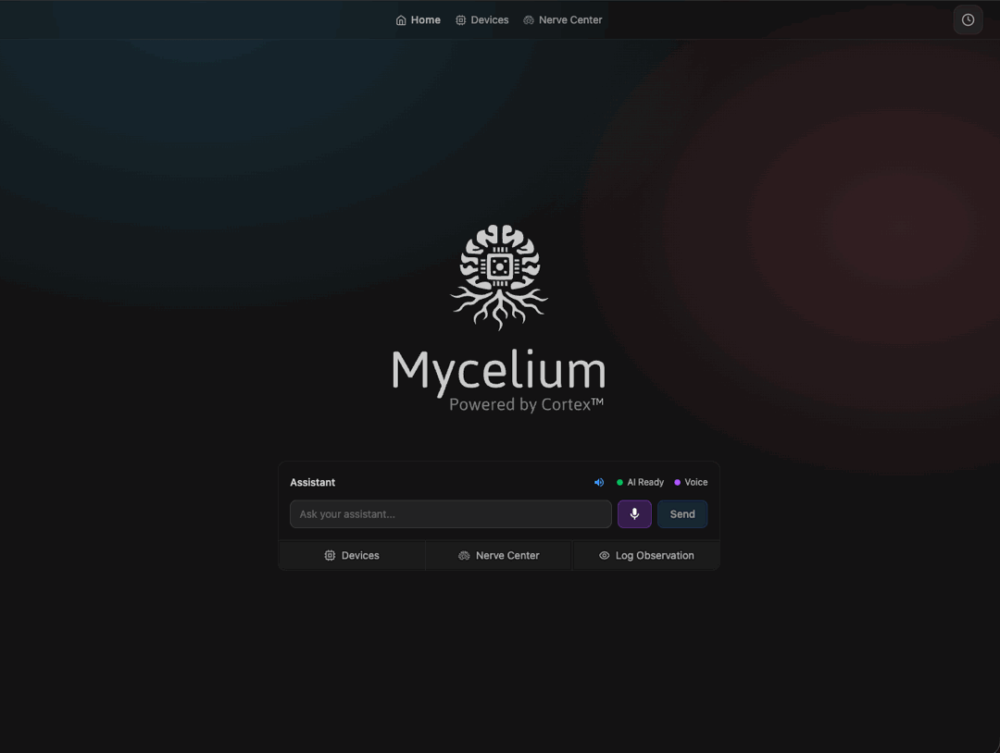
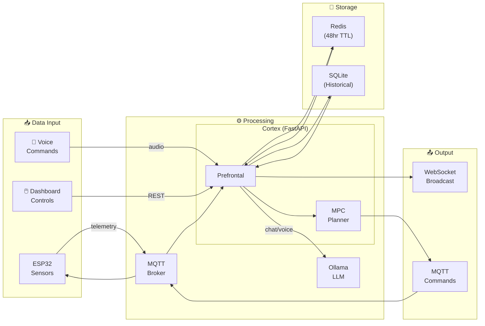
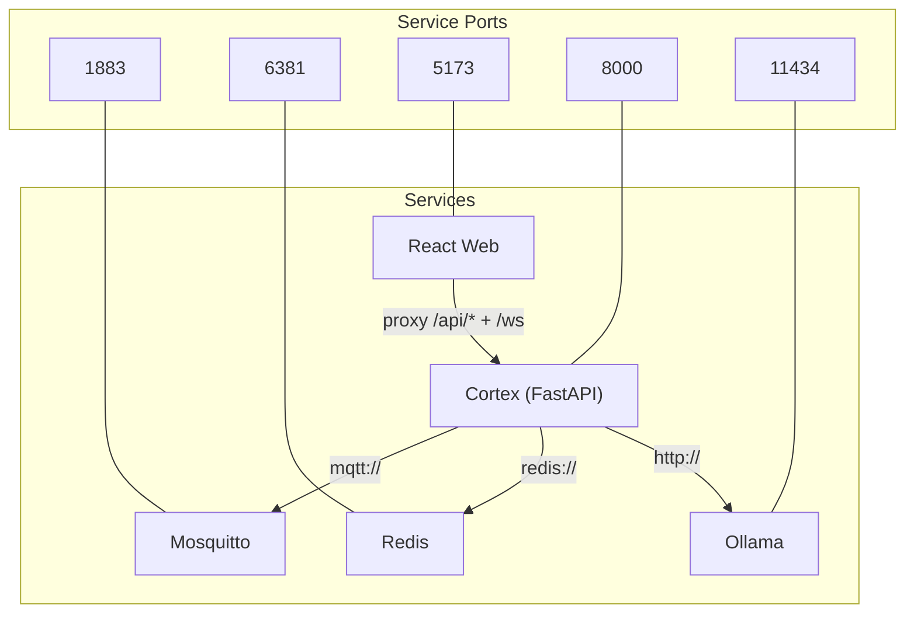
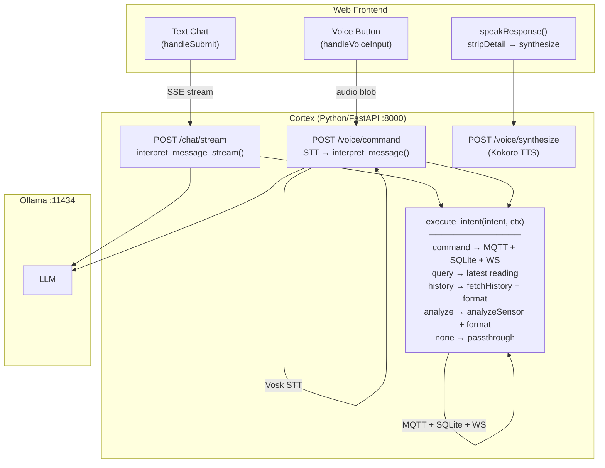
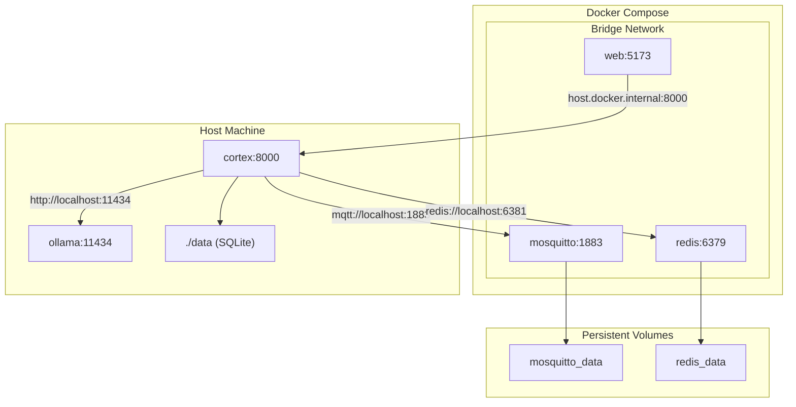
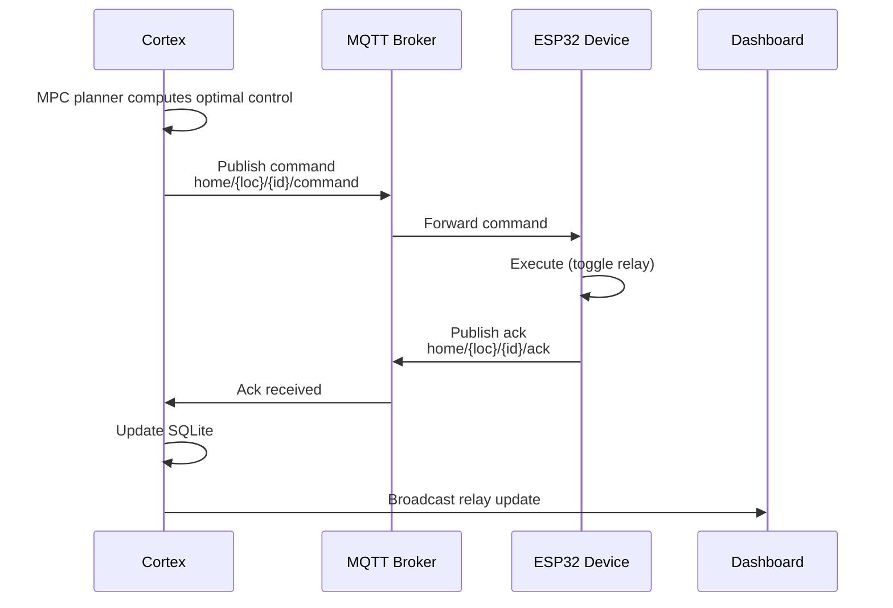

<p align="left">
  
</p>

An open-source framework for building AI-powered IoT systems with ESP32 devices, MQTT messaging, and local LLM intelligence. Devices publish sensor telemetry and receive commands over MQTT, while a local AI orchestrator uses Model Predictive Control (MPC) with physics-based optimization and Ollama LLM for autonomous decision-making.

On the device side, a configuration-driven MicroPython library handles the complexity of microcontroller development. Define your sensors and actuators in a [JSON registry](#device-registry), and the framework automatically initializes hardware drivers (`SWITCH`, `PULSE`, `TempSensor`), manages WiFi connectivity, establishes [MQTT sessions with birth/will lifecycle messages](#mqtt-message-flow), and exposes a [command handler](#command-flow) — all without writing boilerplate. The `HomeHubClient` abstracts MQTT topic structure, correlation-based command acknowledgments, and telemetry publishing into a simple API, so adding a new device is just a registry entry and a [flash](#device-management).

The same device capabilities that drive the firmware also drive the UI. When a device comes online, its birth message advertises its sensors and actuators to the [Cortex backend](#cortex-backend), which dynamically builds per-device panels in the [React dashboard](#web-dashboard) — complete with the correct controls for each actuator type (toggle switches, momentary pulse buttons), live sensor gauges, and historical charts. No frontend code changes are needed to support new devices; plug in an ESP32, define it in the registry, and it appears on the dashboard ready to control from anywhere on the local network via WebSocket, chat, or voice.

AI operates through Model Predictive Control (MPC) converging on MQTT as a shared command bus. The [Cortex backend](#cortex-backend) subscribes to device telemetry and runs a dual-mode MPC system: a convex QP solver (OSQP) with a 7-state thermodynamic model, Extended Kalman Filter state estimation, and sub-100ms solve times for real-time control, or a legacy SLSQP nonlinear shooting planner for physics-based optimization. Both modes predict environment response and compute optimal actuator intensities to meet grow profile goals. The same backend interprets natural language from [chat and voice](#voice--chat-processing-pipeline) through a local Ollama model, which returns structured JSON intents (command, query, history, analyze) that are executed identically regardless of input method. Devices don't know whether a command came from the MPC planner, the LLM, or a user — they all arrive as the same [MQTT message](#message-envelope-format-v1).



- **[Configuration-driven devices](#device-registry)** — declare sensors and actuators in `registry.json`, flash, and go
- **[Dynamic dashboard](#web-dashboard)** — device panels, controls, and charts generated from device capabilities
- **[MPC control](#ai-prefrontal)** — Dual-mode Model Predictive Control: OSQP convex QP with 7-state thermodynamic model and EKF (sub-100ms), or legacy SLSQP with physics-based nonlinear shooting
- **Grow profiles & goals** — per-location grow profiles with strategy (precision/balanced/efficiency), growth phases, and metric goals with compliance scoring
- **Ecosystem health scoring** — weighted goal compliance with strategy-adjusted tolerances, per-metric breakdowns, and historical tracking
- **Derived metrics** — computed sensors: VPD (Tetens equation), dry-back rate (linear regression), DLI (trapezoidal integration)
- **Human observation logging** — log plant-health events sensors can't detect (mold, pests, wilting) via the Activity Center
- **Generic sensor pipeline** — entire telemetry pipeline is sensor-type agnostic; add any sensor type and it flows through MQTT, Redis, SQLite, charts, and baselines automatically
- **[Natural language control](#voice--chat-processing-pipeline)** — chat and voice commands interpreted by Ollama into structured intents
- **HOT data** stored in [Redis](#redis) (48-hour retention)
- **COLD data** aggregated in [SQLite](#sqlite) (historical trends)
- **[Voice interface](#voice-commands)** with speech-to-text (Vosk) and text-to-speech (Kokoro)

## Table of Contents
- [Architecture Overview](#architecture-overview)
- [Prerequisites](#prerequisites)
- [Quick Start](#quick-start)
- [ESP32 Device Setup](#esp32-device-setup)
- [Infrastructure](#infrastructure)
- [AI Prefrontal](#ai-prefrontal)
- [Development](#development)
- [Project Structure](#project-structure)
- [Troubleshooting](#troubleshooting)

## Architecture Overview

### System Architecture


```mermaid
flowchart TB
    subgraph Device["🔌 ESP32 Device"]
        DHT[DHT11 Sensor]
        LED[Status LED]
        MPY[MicroPython]
    end

    subgraph Docker["🐳 Docker Services"]
        MQTT[("🦟 Mosquitto<br/>MQTT Broker<br/>:1883")]
        Redis[("⚡ Redis<br/>HOT Storage<br/>:6381")]
        WEB["⚛️ React Dashboard<br/>:5173"]
    end

    subgraph Host["🖥️ Host Services (Native)"]
        Cortex["🧠 Cortex<br/>Python/FastAPI :8000<br/>API + MQTT + MPC + Voice"]
        SQLite[("📁 SQLite<br/>COLD Storage")]
        Ollama["🤖 Ollama LLM<br/>:11434"]
    end

    subgraph Browser["🌐 Browser"]
        Dashboard["Dashboard UI"]
    end

    DHT --> MPY
    MPY --> LED
    MPY <-->|telemetry/commands| MQTT

    MQTT <-->|subscribe/publish| Cortex

    Cortex --> Redis
    Cortex --> SQLite
    Cortex --> Ollama

    WEB -->|proxy| Cortex
    Dashboard <-->|WebSocket + REST| WEB
```

### Data Flow


```mermaid
flowchart LR
    subgraph Input["📥 Data Input"]
        ESP32["ESP32<br/>Sensors"]
        Voice["🎤 Voice<br/>Commands"]
        UI["🖱️ Dashboard<br/>Controls"]
    end

    subgraph Processing["⚙️ Processing"]
        MQTT["MQTT<br/>Broker"]
        subgraph Cortex["Cortex (FastAPI)"]
            Prefrontal["Prefrontal"]
            MPC["MPC<br/>Planner"]
        end
        LLM["Ollama<br/>LLM"]
    end

    subgraph Storage["💾 Storage"]
        Redis["Redis<br/>(48hr TTL)"]
        SQLite["SQLite<br/>(Historical)"]
    end

    subgraph Output["📤 Output"]
        WS["WebSocket<br/>Broadcast"]
        Commands["MQTT<br/>Commands"]
    end

    ESP32 -->|telemetry| MQTT
    Voice -->|audio| Prefrontal
    UI -->|REST| Prefrontal

    MQTT --> Prefrontal
    Prefrontal --> MPC
    Prefrontal --> Redis
    Prefrontal --> SQLite
    MPC --> Commands
    Prefrontal -->|chat/voice| LLM

    Redis --> Prefrontal
    SQLite --> Prefrontal
    Prefrontal --> WS
    Commands --> MQTT
    MQTT --> ESP32
```

### MQTT Message Flow


```mermaid
sequenceDiagram
    participant D as ESP32 Device
    participant M as MQTT Broker
    participant C as Cortex (FastAPI)
    participant WS as WebSocket Clients

    Note over D,WS: Device Registration (Birth)
    D->>M: home/_registry/{deviceId}/birth
    M->>C: Device capabilities
    C->>WS: {type: "devices", data: [...]}

    Note over D,WS: Telemetry Flow
    loop Every 5 seconds
        D->>M: home/{location}/{deviceId}/telemetry
        M->>C: Store in Redis, evaluate MPC
        C->>WS: {type: "latest", data: {...}}
    end

    Note over C: Background Jobs (periodic)
    C->>C: Aggregate Redis → SQLite

    Note over D,WS: Command Flow (User or AI)
    C->>M: home/{location}/{deviceId}/command
    M->>D: Execute command
    D->>M: home/{location}/{deviceId}/ack
    M->>C: Update command status
    C->>WS: {type: "relays", data: [...]}
```

### Service Communication


```mermaid
flowchart TB
    subgraph Ports["Service Ports"]
        P1883["1883"]
        P6381["6381"]
        P5173["5173"]
        P8000["8000"]
        P11434["11434"]
    end

    subgraph Services
        MQTT["Mosquitto"]
        Redis["Redis"]
        Web["React Web"]
        Cortex["Cortex (FastAPI)"]
        Ollama["Ollama"]
    end

    P1883 --- MQTT
    P6381 --- Redis
    P5173 --- Web
    P8000 --- Cortex
    P11434 --- Ollama

    Web -->|proxy /api/* + /ws| Cortex
    Cortex -->|mqtt://| MQTT
    Cortex -->|redis://| Redis
    Cortex -->|http://| Ollama
```

### Voice & Chat Processing Pipeline

Both text chat and voice commands funnel through a shared `execute_intent()` function, ensuring all intents (command, query, history, analyze) are handled identically regardless of input method.


```mermaid
flowchart TB
    subgraph Frontend["Web Frontend"]
        TextChat["Text Chat<br/>(handleSubmit)"]
        VoiceBtn["Voice Button<br/>(handleVoiceInput)"]
        TTS["speakResponse()<br/>stripDetail → synthesize"]
    end

    subgraph Cortex["Cortex (Python/FastAPI :8000)"]
        ChatStream["POST /chat/stream<br/>interpret_message_stream()"]
        VoiceCmd["POST /voice/command<br/>STT → interpret_message()"]
        Synth["POST /voice/synthesize<br/>(Kokoro TTS)"]

        Executor["execute_intent(intent, ctx)<br/>───────────────<br/>command → MQTT + SQLite + WS<br/>query → latest reading<br/>history → fetchHistory + format<br/>analyze → analyzeSensor + format<br/>none → passthrough"]
    end

    subgraph Ollama["Ollama :11434"]
        LLM["LLM"]
    end

    TextChat -->|SSE stream| ChatStream
    VoiceBtn -->|audio blob| VoiceCmd
    ChatStream --> LLM
    VoiceCmd -->|Vosk STT| VoiceCmd
    VoiceCmd --> LLM
    ChatStream --> Executor
    VoiceCmd --> Executor
    Executor -->|MQTT + SQLite + WS| Executor
    TTS --> Synth
```

### Message Envelope Format (v1)

All MQTT messages follow a standardized envelope format:

```json
{
  "v": 1,
  "ts": 1704067200000,
  "deviceId": "esp32-1",
  "location": "room1",
  "type": "telemetry",
  "payload": {
    "readings": [
      {"id": "temp1", "value": 23.5},
      {"id": "hum1", "value": 65.2}
    ]
  }
}
```

| Field | Type | Description |
|-------|------|-------------|
| `v` | number | Protocol version (always 1) |
| `ts` | number | Unix timestamp in milliseconds |
| `deviceId` | string | Unique device identifier |
| `location` | string | Physical location |
| `type` | string | Message type: `telemetry`, `command`, `ack`, `birth`, `will` |
| `payload` | object | Type-specific data |
| `correlationId` | string | (commands only) For tracking ack responses |
| `source` | string | (commands only) Origin: `dashboard`, `ai`, `api` |

## Prerequisites

### Hardware
- **ESP32 Development Board** with USB connection

### Software
- **Docker** and **Docker Compose** - For running infrastructure (Mosquitto, Redis, Web)
- **Python 3.11+** - For the Cortex backend and device management scripts
- **Node.js** (v18+) and **npm** - For web frontend development
- **mpremote** - MicroPython remote utility for device interaction
  ```bash
  pip install mpremote
  ```

### MicroPython Binary
The project includes a pre-downloaded MicroPython binary for ESP32:
```
./bin/ESP32_GENERIC-20251209-v1.27.0.bin
```

## Quick Start

### 1. Start All Services
```bash
./tools/start.sh
```

This starts everything:

| Service | Port | Runtime | Purpose |
|---------|------|---------|---------|
| **MQTT Broker** (Mosquitto) | `1883` | Docker | Message routing |
| **Redis** | `6381` | Docker | HOT data (48hr) |
| **Cortex** | `8000` | Host | REST API + WebSocket + MQTT + MPC + Voice |
| **Web Dashboard** | `5173` | Docker | React UI |
| **Ollama** | `11434` | Host (Metal GPU) | LLM inference |

The script automatically:
- Starts Ollama and waits for it to be ready
- Pulls the LLM model (`llama3.2:3b`) if not present
- Launches Docker services (Mosquitto, Redis, Web)
- Starts Cortex and waits for it to be ready

To stop everything:
```bash
./tools/stop.sh
```

> **Note:** Cortex and Ollama run natively on the host for performance reasons (Metal GPU acceleration for Ollama, native audio for Kokoro TTS). The web container proxies API requests to the host via `host.docker.internal`.

### 2. Access the Dashboard
Open your browser to:
```
http://localhost:5173
```

### 3. Configure and Flash ESP32 Device
See [ESP32 Device Setup](#esp32-device-setup) below.

## ESP32 Device Setup

### Device Registry

The project uses a central registry (`device/registry.json`) to manage multiple ESP32 devices:

```json
{
  "devices": {
    "esp32-1": {
      "name": "Living Room Hub",
      "location": "living-room",
      "telemetry_interval_ms": 5000,
      "sensors": [
        { "id": "temp1", "type": "temperature", "unit": "celsius", "pin": 2, "driver": "DHT11" },
        { "id": "hum1", "type": "humidity", "unit": "percent", "pin": 2, "driver": "DHT11" }
      ],
      "actuators": [
        { "id": "relay1", "type": "switch", "name": "Status LED", "pin": 5 }
      ]
    },
    "esp32-2": {
      "name": "Bedroom Sensor",
      "location": "bedroom",
      "sensors": [
        { "id": "temp1", "type": "temperature", "unit": "celsius", "pin": 4, "driver": "DHT22" },
        { "id": "hum1", "type": "humidity", "unit": "percent", "pin": 4, "driver": "DHT22" }
      ]
    },
    "esp32-3": {
      "name": "Garage Controller",
      "location": "garage",
      "actuators": [
        { "id": "relay1", "type": "switch", "name": "Overhead Light", "pin": 5 },
        { "id": "relay2", "type": "switch", "name": "Workbench Light", "pin": 18 }
      ]
    }
  },
  "defaults": {
    "mqtt_host": "192.168.1.100",
    "mqtt_port": 1883,
    "wifi_ssid": "Your_WiFi_SSID",
    "wifi_password": "Your_WiFi_Password",
    "telemetry_interval_ms": 5000
  }
}
```

| Field | Description |
|-------|-------------|
| `devices.<id>` | Unique device identifier used in MQTT topics |
| `name` | Human-friendly display name (shown in dashboard and MQTT birth) |
| `location` | Physical location (used in topic hierarchy) |
| `sensors` | Array of sensor definitions (`id`, `type`, `unit`, `pin`, `driver`) |
| `actuators` | Array of actuator definitions (`id`, `type`, `name`, `pin`) |
| `defaults` | Shared network configuration for all devices |

The flash script reads from this registry and auto-generates `secrets.py` for the target device.

### Initial Setup

#### 1. Configure the Registry
Copy the example registry and fill in your credentials:
```bash
cp device/registry.example.json device/registry.json
```

Edit `device/registry.json` with your network settings and device configurations:
- Set `defaults.wifi_ssid` and `defaults.wifi_password` to your WiFi credentials
- Set `defaults.mqtt_host` to your computer's local IP address (not `localhost`)
- Add device entries with their specific hardware pin configurations

#### 2. Connect ESP32
Connect your ESP32 device to your computer via USB.

#### 3. Flash the Device
For a new device (first-time setup with MicroPython):
```bash
./tools/flash.sh esp32-1 --erase
```

For an existing device (code update only):
```bash
./tools/flash.sh esp32-1
```

The flash script will:
1. Auto-detect the serial port (or use `--port` to specify)
2. Generate `secrets.py` from the registry for the specified device
3. Erase and flash MicroPython firmware (if `--erase` flag is set)
4. Upload all device code to the ESP32
5. Verify the installation

List registered devices:
```bash
./tools/flash.sh --list
```

**Note:** Serial port patterns vary by OS:
- macOS: `/dev/tty.usbserial-*` or `/dev/tty.SLAB_USBtoUART`
- Linux: `/dev/ttyUSB0` or `/dev/ttyACM0`
- Windows: `COM3` or similar

### Device Management

#### Monitor Serial Console
View real-time output from the ESP32:
```bash
./tools/repl.sh
```

Press `Ctrl+]` to exit the REPL.

#### Reset Device
Soft reset the ESP32 to restart the application:
```bash
./tools/reset.sh
```

#### Manual File Upload
To upload specific files manually:
```bash
mpremote connect /dev/ttyUSB0 cp ./device/main.py :main.py
```

## Infrastructure

The project uses Docker Compose to orchestrate multiple services:

### Service Architecture


```mermaid
flowchart TB
    subgraph Docker["Docker Compose"]
        subgraph Network["Bridge Network"]
            MQTT["mosquitto:1883"]
            Redis["redis:6379"]
            Web["web:5173"]
        end
    end

    subgraph Host["Host Machine"]
        Cortex["cortex:8000"]
        Ollama["ollama:11434"]
        SQLiteDB["./data (SQLite)"]
    end

    subgraph Volumes["Persistent Volumes"]
        V1["mosquitto_data"]
        V2["redis_data"]
    end

    Cortex -->|mqtt://localhost:1883| MQTT
    Cortex -->|redis://localhost:6381| Redis
    Cortex -->|http://localhost:11434| Ollama
    Cortex --> SQLiteDB
    Web -->|host.docker.internal:8000| Cortex

    MQTT --> V1
    Redis --> V2
```

### MQTT Message Broker (Mosquitto)
- **Purpose:** Handles ingestion of telemetry events from ESP32 devices
- **Port:** `1883`
- **Configuration:** `./mosquitto/mosquitto.conf`

**Topic Structure:**

| Topic Pattern | Purpose | Direction |
|--------------|---------|-----------|
| `home/{location}/{deviceId}/telemetry` | Sensor readings | Device → Server |
| `home/{location}/{deviceId}/command` | Commands to device | Server → Device |
| `home/{location}/{deviceId}/ack` | Command acknowledgments | Device → Server |
| `home/_registry/{deviceId}/birth` | Device registration | Device → Server |
| `home/_registry/{deviceId}/will` | Device offline (LWT) | Broker → Server |

### Redis
- **Purpose:** HOT storage for real-time telemetry data (48-hour retention)
- **Port:** `6381` (mapped from container port `6379`)
- **Persistence:** Append-only file (AOF) enabled
- **Volume:** `redis_data`

### SQLite
- **Purpose:** COLD storage for aggregated telemetry data (30-day views)
- **Location:** `./data/telemetry.sqlite` (managed by Cortex)
- **Journal Mode:** WAL (for concurrent reads)

**Tables:**

| Table | Purpose |
|-------|---------|
| `sensor_values` | Generic per-sensor telemetry (EAV: device_id, sensor_id, ts, value) |
| `sensor_readings` | Legacy historical readings (kept for migration, not actively written) |
| `commands` | Command history with status |
| `events` | Device events log |
| `devices` | Device registry with actuator state and display order |
| `cortex_baselines` | Per-device, per-sensor, per-hour learned baselines (Welford's algorithm) |
| `cortex_outcomes` | Command effectiveness scores with pre/post sensor snapshots |
| `cortex_profiles` | Per-location grow profiles with strategy and growth phase |
| `cortex_goals` | Per-profile metric goals with ranges, tolerance, priority, and schedules |
| `cortex_health` | Periodic ecosystem health snapshots with per-metric breakdowns |
| `cortex_effects` | Learned per-actuator, per-sensor effect deltas (Welford's incremental stats) |

### Cortex Backend
- **Purpose:** Unified backend — REST API, WebSocket, MQTT client, MPC control, voice
- **Technology:** Python/FastAPI
- **Port:** `8000`

**REST Endpoints:**

| Endpoint | Method | Purpose |
|----------|--------|---------|
| `/api/latest` | GET | Current sensor reading |
| `/api/history` | GET | Historical data with bucketing (`deviceId` filter) |
| `/api/outcomes` | GET | Command effectiveness records (`deviceId`, `target` filters) |
| `/api/devices` | GET | Registered devices |
| `/api/devices/order` | PUT | Reorder devices (drag-and-drop) |
| `/api/devices/:id/relays` | GET | Device relay states |
| `/api/devices/:id/relays/:id` | POST/PATCH/DELETE | Individual relay control |
| `/api/commands` | GET/POST | Command history |
| `/api/events` | GET | Device events log |
| `/api/observations` | POST | Log human observation (`{deviceId, category, notes?}`) |
| `/api/cortex/status` | GET | System intelligence overview |
| `/api/cortex/profiles` | GET/POST | Grow profiles (list / create) |
| `/api/cortex/profiles/:id` | GET/PUT/DELETE | Single profile CRUD |
| `/api/cortex/profiles/:id/goals` | GET/POST | Goals for a profile (list / create) |
| `/api/cortex/goals/:id` | PUT/DELETE | Update or delete a goal |
| `/api/cortex/health/:location` | GET | Ecosystem health snapshots (`sinceMs`, `untilMs`) |
| `/api/cortex/effects` | GET | Learned actuator effect profiles (`deviceId`, `actuator`, `minSamples`) |
| `/api/cortex/room-config` | GET | Room configuration (YAML as JSON, or `configured: false`) |
| `/api/chat/stream` | POST | Streaming chat (SSE) |
| `/api/voice/transcribe` | POST | Audio → Text (Vosk STT) |
| `/api/voice/synthesize` | POST | Text → Audio (Kokoro TTS) |
| `/api/voice/command` | POST | Full STT → LLM → execute_intent pipeline |

**WebSocket Endpoint:** `ws://localhost:8000/ws`

Message Types:
- `{type: "latest", data: {readings: {sensor_id: value, ...}, updatedAt, deviceId}}` - Sensor updates (per device)
- `{type: "relays", data: RelayConfig[]}` - Relay state changes
- `{type: "devices", data: Device[]}` - Device registry updates
- `{type: "commands", data: Command[]}` - Command history
- `{type: "command", data: Command}` - Single command broadcast
- `{type: "events", data: DeviceEvent[]}` - Device events
- `{type: "event", data: DeviceEvent}` - Single event broadcast

### Web Dashboard
- **Purpose:** React SPA for visualizing telemetry data
- **Technology:** React + Vite + TypeScript + Tailwind CSS
- **Port:** `5173`
- **Routing:** `react-router-dom` — `/` (Home), `/devices` (Devices), `/nerve-center` (Nerve Center)
- **Features:**
  - Real-time metric cards with circular gauges
  - Time-series charts (Chart.js)
  - Relay control interface
  - Drag-and-drop device panel reordering (persisted)
  - AI status indicator and activity feed (slide-out drawer)
  - Human observation logging (mold, pests, wilting, etc.) via Activity Center
  - Nerve Center with 3 tabs: Overview (health score, active profile, goal count), Goals (profile selector + goal CRUD with phase filtering), Room (read-only room config display)
  - Voice command input
  - Responsive design with container queries

## AI Prefrontal

Cortex uses Model Predictive Control (MPC) to autonomously monitor sensor readings and compute optimal actuator control. Two solver modes are available, selected via `MPC_MODE` environment variable.

### How It Works

1. **MPC Control (OSQP)** — `MPC_MODE=osqp` — A 7-state thermodynamic model (T_air, humidity, CO2, T_leaf, substrate moisture, T_supply, T_wall) is linearized at each step and solved as a convex QP via OSQP with warm-starting. An Extended Kalman Filter fuses sensor data (handling missing sensors gracefully). Phase-dependent reference trajectories (veg, early/mid/late flower, dry) with day/night targets drive the controller. Sub-100ms solve times with variable scaling. Fail-safe graceful degradation (MPC_NORMAL → MPC_HOLD → MPC_OFFLINE) ensures safe operation even if the solver fails.
2. **MPC Control (SLSQP)** — `MPC_MODE=slsqp` (default) — The legacy `MPCPlanner` uses `scipy.optimize.minimize` (SLSQP) with direct nonlinear shooting over a rolling horizon. The physics engine (`PhysicsEngine` or `FastPhysicsEngine`) serves as the prediction model, and the optimizer finds actuator intensities that minimize goal deviation + energy + rate-of-change
3. **Grow Profiles & Goals** - Per-location grow profiles define strategy (precision/balanced/efficiency) and growth phase; metric goals set target ranges with tolerance and priority weights
4. **Ecosystem Health** - `EcosystemHealthScorer` computes weighted compliance across all goals with strategy-adjusted tolerances; derived metrics (VPD, dry-back rate, DLI) are computed from raw sensor data
5. **Direct MQTT** - MPC subscribes to telemetry and publishes commands directly
6. **Voice Interface** - STT (Vosk) → LLM → TTS (Kokoro) pipeline

### Command Flow


```mermaid
sequenceDiagram
    participant C as Cortex
    participant M as MQTT Broker
    participant D as ESP32 Device
    participant WS as Dashboard

    C->>C: MPC planner computes optimal control
    C->>M: Publish command<br/>home/{loc}/{id}/command
    M->>D: Forward command
    D->>D: Execute (toggle relay)
    D->>M: Publish ack<br/>home/{loc}/{id}/ack
    M->>C: Ack received
    C->>C: Update SQLite
    C->>WS: Broadcast relay update
```

### Voice Commands

The AI service supports voice interaction through a complete STT → LLM → TTS pipeline:

| Endpoint | Purpose |
|----------|---------|
| `POST /voice/transcribe` | Audio → Text (Vosk) |
| `POST /voice/synthesize` | Text → Audio (Kokoro) |
| `POST /voice/command` | Full pipeline: Audio → Text → LLM → executeIntent → Response |

**Supported Audio Formats:** WAV, WebM, OGG, MP4 (via ffmpeg conversion)

**TTS Text Normalization:** The TTS pipeline automatically converts numbers, times, currency, percentages, ordinals, and units to spoken English. Emojis, markdown, and symbols are stripped. Long text is split into chunks to stay within Kokoro's 510 phoneme limit.

## Development

### Local Development (without Docker)

#### Start Cortex Backend
```bash
cd apps/cortex
python -m src.main
```

#### Start Web Frontend
```bash
cd apps/web
npm run dev
```

#### Start All Services
The start script handles Ollama, Docker infrastructure, and Cortex:
```bash
./tools/start.sh
```

### Testing

The Cortex backend includes unit tests and end-to-end simulation tests.

#### Unit Tests (no external services needed)
```bash
cd apps/cortex
pytest tests/ -m "not e2e" -v
```

Covers: `cortex_api.py` (status, profiles, goals, room-config endpoints), `derived_metrics.py` (VPD calculation, dry-back rate, DLI integration), `ecosystem_health.py` (health scoring, strategy tolerance, goal compliance), `grow_profiles.py` (profile/goal CRUD, phase validation), `data_reader.py` (Redis+SQLite merge, deduplication), `observations.py` (endpoint validation, storage, broadcast), `sensor_values.py` (EAV table CRUD, bucketed queries, migration), `sensor_meta.py` (sensor type resolution, unit/label helpers), `chat_session.py` (session store, TTL expiration), `mpc_model.py` (7-state thermodynamic model, SVP, humidity, dynamics, linearization), `mpc_solver.py` (OSQP solver feasibility, bounds, timing <100ms, warm-start), `estimator.py` (EKF predict/update, missing sensors, covariance stability), `compliance.py` (ring buffer, in/out-of-band tracking, RMSE, dryback rate), `failsafe.py` (state transitions, recovery, safe defaults), `state_planner.py` (MPCConfig, GoalSpec, cost functions, solver convergence, warm start), `simulation_mpc.py` (MPC runner, diagnostics, energy tracking, compliance, chart generation), `simulation_multi_day.py` (ambient schedule, multi-day runner, convergence), `fast_physics.py` (SVP lookup, psychrometrics, direction tests, benchmarks), `fast_physics_mpc.py` (MPC with FastPhysicsEngine), `duct_physics.py` (system resistance, fan operating point, ACH), `substrate_physics.py` (presets, geometry, evap modifier, stress), `room_config.py` (YAML loading, validation, ventilation/substrate parsing).

#### Grow Tent Simulation (offline, no external services)
```bash
cd apps/cortex

# MPC simulation (default) — 3h, 15min horizon, SLSQP
python -m simulations.simulate

# MPC with variable-speed actuators (EC fans, dimmable LEDs)
python -m simulations.simulate --variable -v

# Custom room configuration
python -m simulations.simulate --room simulations/rooms/commercial_10x10.yaml -v

# Custom horizon and energy weight
python -m simulations.simulate --horizon 30 --w-energy 0.1 -v

# Fast physics — lightweight engine for faster MPC solves
python -m simulations.simulate --fast-physics -v

# Multi-day simulation — 96h with periodic MPC checkpoints
python -m simulations.simulate --multi-day -v
python -m simulations.simulate --multi-day --fast-physics -v

# Custom parameters
python -m simulations.simulate --duration 360 --start-hour 6 -v
```

Output charts saved to `apps/cortex/simulations/output/`. The simulation models a sealed grow tent with 6 state variables (temperature, humidity, soil moisture, CO2, leaf temperature, VPD), 7 continuous actuators at 0.0–1.0 intensity (fan, exhaust, humidifier, dehumidifier, irrigation, grow light, CO2 injector), and coupled plant physiology (Ball-Berry stomatal conductance, photosynthesis response surface with light/CO2/temperature/VPD factors, transpiration). The physics engine models air exchange (ACH from base infiltration + exhaust intensity), CO2 mass balance (injection − plant uptake − ventilation + dark respiration), transpiration cooling, and cross-variable interactions (heat accelerates soil drying, wet soil raises humidity, plant transpiration adds moisture and cools leaf surfaces). The MPC planner uses `scipy.optimize.minimize` (SLSQP) with direct nonlinear shooting — state save/restore + `step()` as the prediction model — to find optimal actuator intensities over a 15-minute rolling horizon. Cost = weighted goal deviation + energy + actuator chattering penalty. Light/CO2 schedule enforced as hard bound constraints. Warm start between solves for ~75ms average solve time. Scenario data (profiles, goals, flower goals, MPC config) is defined in `simulations/scenarios/default.py`.

#### E2E Simulation Tests (requires running stack)
```bash
# Start services first
docker compose up -d mosquitto redis
cd apps/cortex && python -m src.main &

# Run e2e tests
pytest tests/ -m e2e -v
```

Exercises: device birth via MQTT, telemetry ingestion, relay control, command ACK, API endpoint regression, baseline accumulation.

### Working with Device Code

The `./device/` directory contains MicroPython code:

- **`boot.py`** - Runs on device startup, handles WiFi connection
- **`main.py`** - Main application loop with command handling
- **`config.py`** - Device configuration settings
- **`secrets.py`** - WiFi and API credentials (gitignored)
- **`lib/`** - Hardware abstraction modules
  - `home_hub.py` - HomeHubClient for standardized MQTT messaging
  - `led.py` - LED control
  - `wifi.py` - WiFi management
  - `sensors/` - Sensor drivers
- **`services/`** - Service integrations
  - `mqtt.py` - MQTT client with subscribe/publish/callback support
  - `web.py` - HTTP client for API calls

#### HomeHubClient Usage

All ESP32 devices use the `HomeHubClient` class to implement a consistent messaging contract:

```python
from lib.home_hub import HomeHubClient

hub = HomeHubClient(DEVICE_ID, DEVICE_NAME, LOCATION, mqtt_client)

# Register capabilities
hub.register_sensor("temp1", "temperature", unit="celsius")
hub.register_actuator("relay1", "switch", name="Light")

# Handle incoming commands
def handle_command(correlation_id, target, action, value, ttl):
    # Execute action...
    hub.publish_ack(correlation_id, "executed", target, value)

hub.on_command(handle_command)
hub.publish_birth()

# Main loop
while True:
    hub.check_messages()
    hub.publish_telemetry([{"id": "temp1", "value": temp}])
```


## Troubleshooting

### ESP32 Device Issues

#### Device Not Connecting to WiFi
- Verify WiFi credentials in `./device/secrets.py`
- Check that your WiFi network is 2.4GHz (ESP32 doesn't support 5GHz)
- Monitor the serial console with `./tools/repl.sh` to see connection errors
- Ensure the ESP32 is within range of your WiFi router

#### Cannot Flash Device
- Check USB cable (some cables are power-only, need data cable)
- Verify correct port with `ls /dev/tty.*` (macOS) or `ls /dev/ttyUSB*` (Linux)
- Install USB-to-Serial drivers if needed (CP210x or CH340)
- Try holding the BOOT button while flashing

#### Device Keeps Rebooting
- Check power supply (USB port may not provide enough current)
- Look for errors in serial console output
- Verify all required files were uploaded correctly
- Check for syntax errors in device code

#### No Data Appearing in Dashboard
- Verify ESP32 is connected to WiFi (check serial output)
- Ensure `mqtt_host` in `registry.json` uses your computer's local IP, not `localhost`
- Check that Cortex is running: `curl http://localhost:8000/health`
- Verify MQTT broker is accessible from ESP32: `mosquitto_pub -h localhost -p 1883 -t test -m "hello"`

### Hot Reload Not Working
- Ensure volumes are correctly mounted in `docker-compose.yml`
- Try restarting the specific service: `docker compose restart web`

### Check Service Health
```bash
# Ollama (host-native)
curl http://localhost:11434/api/tags

# Cortex (host-native)
curl http://localhost:8000/health

# Redis (Docker)
redis-cli -p 6381 ping

# MQTT broker (Docker)
mosquitto_pub -h localhost -p 1883 -t test -m "hello"
```

### Common Issues

| Symptom | Likely Cause | Solution |
|---------|--------------|----------|
| Dashboard shows "Disconnected" | WebSocket connection failed | Check Cortex logs, verify port 8000 |
| No real-time updates | MQTT not connected | Check Mosquitto logs, verify port 1883 |
| AI commands not executing | MPC not running | Check Cortex logs, verify goals are configured |
| Voice commands not working | STT/TTS models missing | Download Vosk/Kokoro models |
| "host.docker.internal" errors | Docker networking issue | Use host network mode or local IP |
