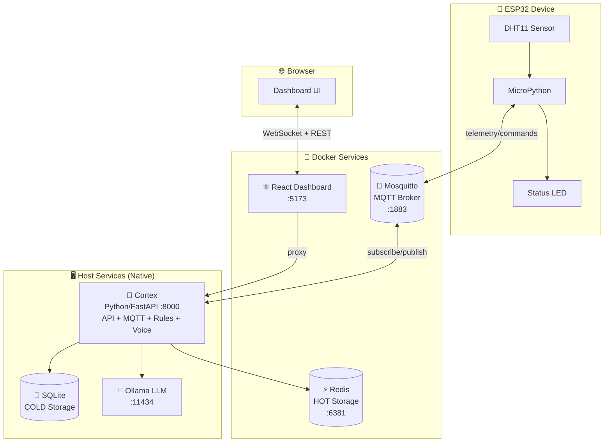
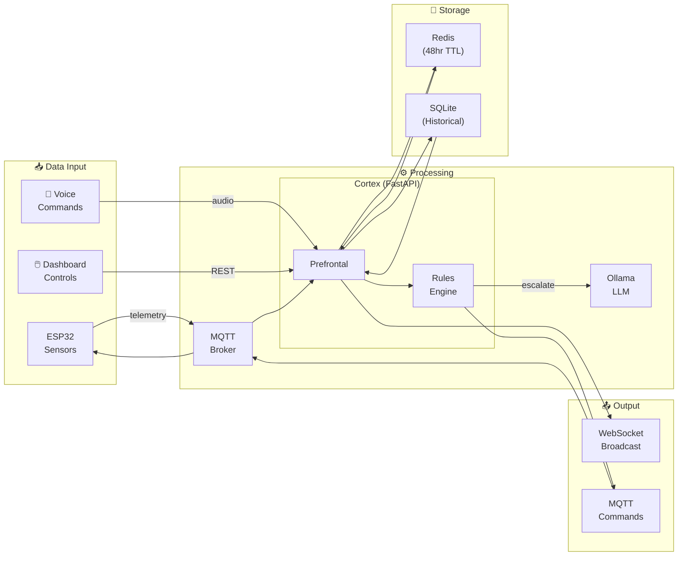
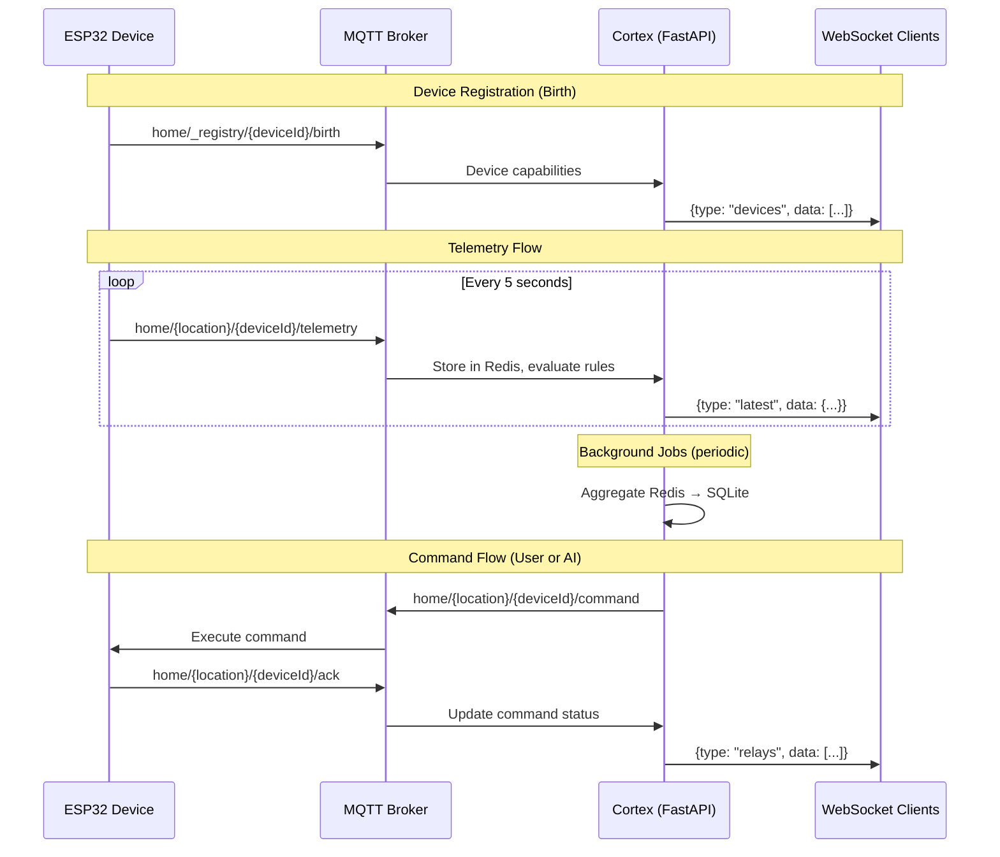
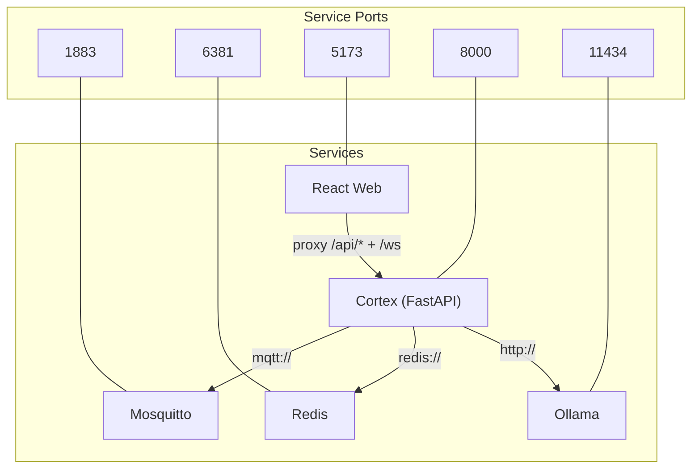
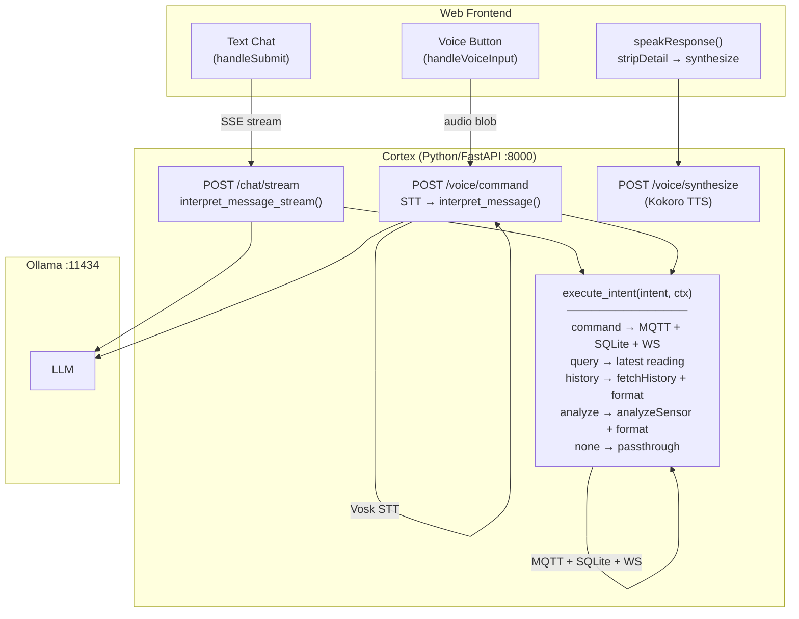
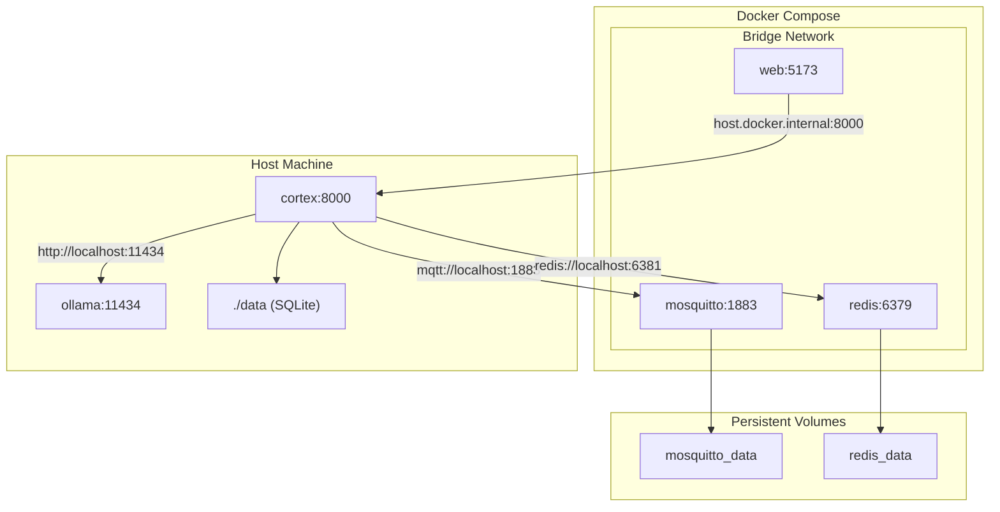
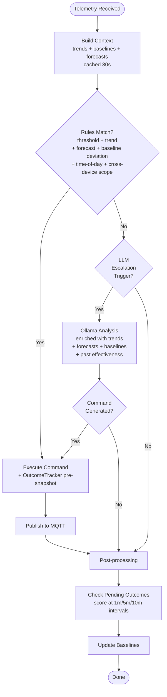
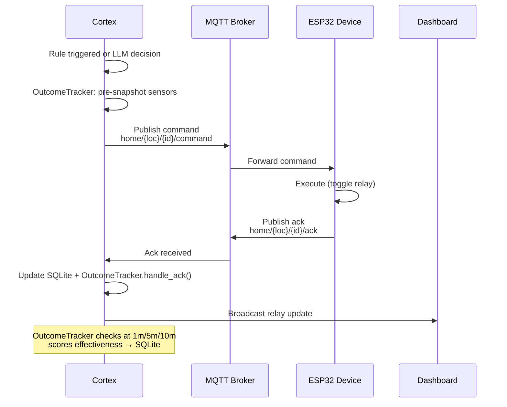

<p align="left">
  
</p>

An open-source framework for building AI-powered IoT systems with ESP32 devices, MQTT messaging, and local LLM intelligence. Devices publish sensor telemetry and receive commands over MQTT, while a local AI orchestrator evaluates configurable rules and escalates to Ollama for autonomous decision-making.

On the device side, a configuration-driven MicroPython library handles the complexity of microcontroller development. Define your sensors and actuators in a [JSON registry](#device-registry), and the framework automatically initializes hardware drivers (`SWITCH`, `PULSE`, `TempSensor`), manages WiFi connectivity, establishes [MQTT sessions with birth/will lifecycle messages](#mqtt-message-flow), and exposes a [command handler](#command-flow) — all without writing boilerplate. The `HomeHubClient` abstracts MQTT topic structure, correlation-based command acknowledgments, and telemetry publishing into a simple API, so adding a new device is just a registry entry and a [flash](#device-management).

The same device capabilities that drive the firmware also drive the UI. When a device comes online, its birth message advertises its sensors and actuators to the [Cortex backend](#cortex-backend), which dynamically builds per-device panels in the [React dashboard](#web-dashboard) — complete with the correct controls for each actuator type (toggle switches, momentary pulse buttons), live sensor gauges, and historical charts. No frontend code changes are needed to support new devices; plug in an ESP32, define it in the registry, and it appears on the dashboard ready to control from anywhere on the local network via WebSocket, chat, or voice.

AI operates on two independent paths that converge on MQTT as a shared command bus. The [Cortex backend](#cortex-backend) subscribes to device telemetry and continuously evaluates a [YAML rules engine](#configuration) — threshold conditions with duration guards and cooldown timers that prevent false positives and rapid toggling. When readings exceed rule boundaries (e.g., temperature above 25°C for 15 seconds), it publishes commands directly to devices without human intervention. For anomalies the rules can't handle, like rapid temperature swings exceeding 5°C per minute, the engine [escalates to a local Ollama LLM](#decision-flow) for reasoning. The same backend interprets natural language from [chat and voice](#voice--chat-processing-pipeline) through the same Ollama model, which returns structured JSON intents (command, query, history, analyze) that are executed identically regardless of input method. Devices don't know whether a command came from a rule, the LLM, or a user — they all arrive as the same [MQTT message](#message-envelope-format-v1).

- **[Configuration-driven devices](#device-registry)** — declare sensors and actuators in `registry.json`, flash, and go
- **[Dynamic dashboard](#web-dashboard)** — device panels, controls, and charts generated from device capabilities
- **[Autonomous rules engine](#ai-prefrontal)** — YAML-defined thresholds with trend conditions, time-of-day windows, duration guards, cooldowns, and LLM escalation
- **[Predictive forecasting](#how-it-works)** — linear projection and EWMA smoothing to act before thresholds are breached
- **[Baseline learning](#how-it-works)** — per-device, per-hour baselines for "unusual for this time of day" detection
- **[Outcome tracking](#how-it-works)** — commands correlated with sensor effects, effectiveness scored and fed back to LLM
- **[Adaptive learning](#how-it-works)** — Rule Advisor analyzes outcome data every 6 hours, uses LLM to suggest threshold/timing adjustments, auto-applies high-confidence changes
- **[Multi-device coordination](#how-it-works)** — cross-device rules with `scope` (read from any/all devices) and `target_scope` (send to all/specific devices)
- **Human observation logging** — log plant-health events sensors can't detect (mold, pests, wilting) via the Activity Center
- **[Natural language control](#voice--chat-processing-pipeline)** — chat and voice commands interpreted by Ollama into structured intents
- **HOT data** stored in [Redis](#redis) (48-hour retention)
- **COLD data** aggregated in [SQLite](#sqlite) (historical trends)
- **[Voice interface](#voice-commands)** with speech-to-text (Vosk) and text-to-speech (Kokoro)

## Table of Contents
- [Architecture Overview](#architecture-overview)
- [Prerequisites](#prerequisites)
- [Quick Start](#quick-start)
- [ESP32 Device Setup](#esp32-device-setup)
- [Infrastructure](#infrastructure)
- [AI Prefrontal](#ai-prefrontal)
- [Development](#development)
- [Project Structure](#project-structure)
- [Troubleshooting](#troubleshooting)

## Architecture Overview

### System Architecture


```mermaid
flowchart TB
    subgraph Device["🔌 ESP32 Device"]
        DHT[DHT11 Sensor]
        LED[Status LED]
        MPY[MicroPython]
    end

    subgraph Docker["🐳 Docker Services"]
        MQTT[("🦟 Mosquitto<br/>MQTT Broker<br/>:1883")]
        Redis[("⚡ Redis<br/>HOT Storage<br/>:6381")]
        WEB["⚛️ React Dashboard<br/>:5173"]
    end

    subgraph Host["🖥️ Host Services (Native)"]
        Cortex["🧠 Cortex<br/>Python/FastAPI :8000<br/>API + MQTT + Rules + Voice"]
        SQLite[("📁 SQLite<br/>COLD Storage")]
        Ollama["🤖 Ollama LLM<br/>:11434"]
    end

    subgraph Browser["🌐 Browser"]
        Dashboard["Dashboard UI"]
    end

    DHT --> MPY
    MPY --> LED
    MPY <-->|telemetry/commands| MQTT

    MQTT <-->|subscribe/publish| Cortex

    Cortex --> Redis
    Cortex --> SQLite
    Cortex --> Ollama

    WEB -->|proxy| Cortex
    Dashboard <-->|WebSocket + REST| WEB
```

### Data Flow


```mermaid
flowchart LR
    subgraph Input["📥 Data Input"]
        ESP32["ESP32<br/>Sensors"]
        Voice["🎤 Voice<br/>Commands"]
        UI["🖱️ Dashboard<br/>Controls"]
    end

    subgraph Processing["⚙️ Processing"]
        MQTT["MQTT<br/>Broker"]
        subgraph Cortex["Cortex (FastAPI)"]
            Prefrontal["Prefrontal"]
            Rules["Rules<br/>Engine"]
        end
        LLM["Ollama<br/>LLM"]
    end

    subgraph Storage["💾 Storage"]
        Redis["Redis<br/>(48hr TTL)"]
        SQLite["SQLite<br/>(Historical)"]
    end

    subgraph Output["📤 Output"]
        WS["WebSocket<br/>Broadcast"]
        Commands["MQTT<br/>Commands"]
    end

    ESP32 -->|telemetry| MQTT
    Voice -->|audio| Prefrontal
    UI -->|REST| Prefrontal

    MQTT --> Prefrontal
    Prefrontal --> Rules
    Prefrontal --> Redis
    Prefrontal --> SQLite
    Rules -->|escalate| LLM
    Rules --> Commands

    Redis --> Prefrontal
    SQLite --> Prefrontal
    Prefrontal --> WS
    Commands --> MQTT
    MQTT --> ESP32
```

### MQTT Message Flow


```mermaid
sequenceDiagram
    participant D as ESP32 Device
    participant M as MQTT Broker
    participant C as Cortex (FastAPI)
    participant WS as WebSocket Clients

    Note over D,WS: Device Registration (Birth)
    D->>M: home/_registry/{deviceId}/birth
    M->>C: Device capabilities
    C->>WS: {type: "devices", data: [...]}

    Note over D,WS: Telemetry Flow
    loop Every 5 seconds
        D->>M: home/{location}/{deviceId}/telemetry
        M->>C: Store in Redis, evaluate rules
        C->>WS: {type: "latest", data: {...}}
    end

    Note over C: Background Jobs (periodic)
    C->>C: Aggregate Redis → SQLite

    Note over D,WS: Command Flow (User or AI)
    C->>M: home/{location}/{deviceId}/command
    M->>D: Execute command
    D->>M: home/{location}/{deviceId}/ack
    M->>C: Update command status
    C->>WS: {type: "relays", data: [...]}
```

### Service Communication


```mermaid
flowchart TB
    subgraph Ports["Service Ports"]
        P1883["1883"]
        P6381["6381"]
        P5173["5173"]
        P8000["8000"]
        P11434["11434"]
    end

    subgraph Services
        MQTT["Mosquitto"]
        Redis["Redis"]
        Web["React Web"]
        Cortex["Cortex (FastAPI)"]
        Ollama["Ollama"]
    end

    P1883 --- MQTT
    P6381 --- Redis
    P5173 --- Web
    P8000 --- Cortex
    P11434 --- Ollama

    Web -->|proxy /api/* + /ws| Cortex
    Cortex -->|mqtt://| MQTT
    Cortex -->|redis://| Redis
    Cortex -->|http://| Ollama
```

### Voice & Chat Processing Pipeline

Both text chat and voice commands funnel through a shared `execute_intent()` function, ensuring all intents (command, query, history, analyze) are handled identically regardless of input method.


```mermaid
flowchart TB
    subgraph Frontend["Web Frontend"]
        TextChat["Text Chat<br/>(handleSubmit)"]
        VoiceBtn["Voice Button<br/>(handleVoiceInput)"]
        TTS["speakResponse()<br/>stripDetail → synthesize"]
    end

    subgraph Cortex["Cortex (Python/FastAPI :8000)"]
        ChatStream["POST /chat/stream<br/>interpret_message_stream()"]
        VoiceCmd["POST /voice/command<br/>STT → interpret_message()"]
        Synth["POST /voice/synthesize<br/>(Kokoro TTS)"]

        Executor["execute_intent(intent, ctx)<br/>───────────────<br/>command → MQTT + SQLite + WS<br/>query → latest reading<br/>history → fetchHistory + format<br/>analyze → analyzeSensor + format<br/>none → passthrough"]
    end

    subgraph Ollama["Ollama :11434"]
        LLM["LLM"]
    end

    TextChat -->|SSE stream| ChatStream
    VoiceBtn -->|audio blob| VoiceCmd
    ChatStream --> LLM
    VoiceCmd -->|Vosk STT| VoiceCmd
    VoiceCmd --> LLM
    ChatStream --> Executor
    VoiceCmd --> Executor
    Executor -->|MQTT + SQLite + WS| Executor
    TTS --> Synth
```

### Message Envelope Format (v1)

All MQTT messages follow a standardized envelope format:

```json
{
  "v": 1,
  "ts": 1704067200000,
  "deviceId": "esp32-1",
  "location": "room1",
  "type": "telemetry",
  "payload": {
    "readings": [
      {"id": "temp1", "value": 23.5},
      {"id": "hum1", "value": 65.2}
    ]
  }
}
```

| Field | Type | Description |
|-------|------|-------------|
| `v` | number | Protocol version (always 1) |
| `ts` | number | Unix timestamp in milliseconds |
| `deviceId` | string | Unique device identifier |
| `location` | string | Physical location |
| `type` | string | Message type: `telemetry`, `command`, `ack`, `birth`, `will` |
| `payload` | object | Type-specific data |
| `correlationId` | string | (commands only) For tracking ack responses |
| `source` | string | (commands only) Origin: `dashboard`, `ai`, `api` |

## Prerequisites

### Hardware
- **ESP32 Development Board** with USB connection

### Software
- **Docker** and **Docker Compose** - For running infrastructure (Mosquitto, Redis, Web)
- **Python 3.11+** - For the Cortex backend and device management scripts
- **Node.js** (v18+) and **npm** - For web frontend development
- **mpremote** - MicroPython remote utility for device interaction
  ```bash
  pip install mpremote
  ```

### MicroPython Binary
The project includes a pre-downloaded MicroPython binary for ESP32:
```
./bin/ESP32_GENERIC-20251209-v1.27.0.bin
```

## Quick Start

### 1. Start All Services
```bash
./tools/start.sh
```

This starts everything:

| Service | Port | Runtime | Purpose |
|---------|------|---------|---------|
| **MQTT Broker** (Mosquitto) | `1883` | Docker | Message routing |
| **Redis** | `6381` | Docker | HOT data (48hr) |
| **Cortex** | `8000` | Host | REST API + WebSocket + MQTT + Rules + Voice |
| **Web Dashboard** | `5173` | Docker | React UI |
| **Ollama** | `11434` | Host (Metal GPU) | LLM inference |

The script automatically:
- Starts Ollama and waits for it to be ready
- Pulls the LLM model (`llama3.2:3b`) if not present
- Launches Docker services (Mosquitto, Redis, Web)
- Starts Cortex and waits for it to be ready

To stop everything:
```bash
./tools/stop.sh
```

> **Note:** Cortex and Ollama run natively on the host for performance reasons (Metal GPU acceleration for Ollama, native audio for Kokoro TTS). The web container proxies API requests to the host via `host.docker.internal`.

### 2. Access the Dashboard
Open your browser to:
```
http://localhost:5173
```

### 3. Configure and Flash ESP32 Device
See [ESP32 Device Setup](#esp32-device-setup) below.

## ESP32 Device Setup

### Device Registry

The project uses a central registry (`device/registry.json`) to manage multiple ESP32 devices:

```json
{
  "devices": {
    "esp32-1": {
      "name": "Living Room Hub",
      "location": "living-room",
      "telemetry_interval_ms": 5000,
      "sensors": [
        { "id": "temp1", "type": "temperature", "unit": "celsius", "pin": 2, "driver": "DHT11" },
        { "id": "hum1", "type": "humidity", "unit": "percent", "pin": 2, "driver": "DHT11" }
      ],
      "actuators": [
        { "id": "relay1", "type": "switch", "name": "Status LED", "pin": 5 }
      ]
    },
    "esp32-2": {
      "name": "Bedroom Sensor",
      "location": "bedroom",
      "sensors": [
        { "id": "temp1", "type": "temperature", "unit": "celsius", "pin": 4, "driver": "DHT22" },
        { "id": "hum1", "type": "humidity", "unit": "percent", "pin": 4, "driver": "DHT22" }
      ]
    },
    "esp32-3": {
      "name": "Garage Controller",
      "location": "garage",
      "actuators": [
        { "id": "relay1", "type": "switch", "name": "Overhead Light", "pin": 5 },
        { "id": "relay2", "type": "switch", "name": "Workbench Light", "pin": 18 }
      ]
    }
  },
  "defaults": {
    "mqtt_host": "192.168.1.100",
    "mqtt_port": 1883,
    "wifi_ssid": "Your_WiFi_SSID",
    "wifi_password": "Your_WiFi_Password",
    "telemetry_interval_ms": 5000
  }
}
```

| Field | Description |
|-------|-------------|
| `devices.<id>` | Unique device identifier used in MQTT topics |
| `name` | Human-friendly display name (shown in dashboard and MQTT birth) |
| `location` | Physical location (used in topic hierarchy) |
| `sensors` | Array of sensor definitions (`id`, `type`, `unit`, `pin`, `driver`) |
| `actuators` | Array of actuator definitions (`id`, `type`, `name`, `pin`) |
| `defaults` | Shared network configuration for all devices |

The flash script reads from this registry and auto-generates `secrets.py` for the target device.

### Initial Setup

#### 1. Configure the Registry
Copy the example registry and fill in your credentials:
```bash
cp device/registry.example.json device/registry.json
```

Edit `device/registry.json` with your network settings and device configurations:
- Set `defaults.wifi_ssid` and `defaults.wifi_password` to your WiFi credentials
- Set `defaults.mqtt_host` to your computer's local IP address (not `localhost`)
- Add device entries with their specific hardware pin configurations

#### 2. Connect ESP32
Connect your ESP32 device to your computer via USB.

#### 3. Flash the Device
For a new device (first-time setup with MicroPython):
```bash
./tools/flash.sh esp32-1 --erase
```

For an existing device (code update only):
```bash
./tools/flash.sh esp32-1
```

The flash script will:
1. Auto-detect the serial port (or use `--port` to specify)
2. Generate `secrets.py` from the registry for the specified device
3. Erase and flash MicroPython firmware (if `--erase` flag is set)
4. Upload all device code to the ESP32
5. Verify the installation

List registered devices:
```bash
./tools/flash.sh --list
```

**Note:** Serial port patterns vary by OS:
- macOS: `/dev/tty.usbserial-*` or `/dev/tty.SLAB_USBtoUART`
- Linux: `/dev/ttyUSB0` or `/dev/ttyACM0`
- Windows: `COM3` or similar

### Device Management

#### Monitor Serial Console
View real-time output from the ESP32:
```bash
./tools/repl.sh
```

Press `Ctrl+]` to exit the REPL.

#### Reset Device
Soft reset the ESP32 to restart the application:
```bash
./tools/reset.sh
```

#### Manual File Upload
To upload specific files manually:
```bash
mpremote connect /dev/ttyUSB0 cp ./device/main.py :main.py
```

## Infrastructure

The project uses Docker Compose to orchestrate multiple services:

### Service Architecture


```mermaid
flowchart TB
    subgraph Docker["Docker Compose"]
        subgraph Network["Bridge Network"]
            MQTT["mosquitto:1883"]
            Redis["redis:6379"]
            Web["web:5173"]
        end
    end

    subgraph Host["Host Machine"]
        Cortex["cortex:8000"]
        Ollama["ollama:11434"]
        SQLiteDB["./data (SQLite)"]
    end

    subgraph Volumes["Persistent Volumes"]
        V1["mosquitto_data"]
        V2["redis_data"]
    end

    Cortex -->|mqtt://localhost:1883| MQTT
    Cortex -->|redis://localhost:6381| Redis
    Cortex -->|http://localhost:11434| Ollama
    Cortex --> SQLiteDB
    Web -->|host.docker.internal:8000| Cortex

    MQTT --> V1
    Redis --> V2
```

### MQTT Message Broker (Mosquitto)
- **Purpose:** Handles ingestion of telemetry events from ESP32 devices
- **Port:** `1883`
- **Configuration:** `./mosquitto/mosquitto.conf`

**Topic Structure:**

| Topic Pattern | Purpose | Direction |
|--------------|---------|-----------|
| `home/{location}/{deviceId}/telemetry` | Sensor readings | Device → Server |
| `home/{location}/{deviceId}/command` | Commands to device | Server → Device |
| `home/{location}/{deviceId}/ack` | Command acknowledgments | Device → Server |
| `home/_registry/{deviceId}/birth` | Device registration | Device → Server |
| `home/_registry/{deviceId}/will` | Device offline (LWT) | Broker → Server |

### Redis
- **Purpose:** HOT storage for real-time telemetry data (48-hour retention)
- **Port:** `6381` (mapped from container port `6379`)
- **Persistence:** Append-only file (AOF) enabled
- **Volume:** `redis_data`

### SQLite
- **Purpose:** COLD storage for aggregated telemetry data (30-day views)
- **Location:** `./data/telemetry.sqlite` (managed by Cortex)
- **Journal Mode:** WAL (for concurrent reads)

**Tables:**

| Table | Purpose |
|-------|---------|
| `sensor_readings` | Historical sensor readings |
| `commands` | Command history with status |
| `events` | Device events log |
| `devices` | Device registry with actuator state and display order |
| `cortex_baselines` | Per-device, per-sensor, per-hour learned baselines (Welford's algorithm) |
| `cortex_outcomes` | Command effectiveness scores with pre/post sensor snapshots (Phase 2) |
| `cortex_suggestions` | Rule adjustment suggestions from the Rule Advisor (Phase 4) |

### Cortex Backend
- **Purpose:** Unified backend — REST API, WebSocket, MQTT client, rules engine, voice
- **Technology:** Python/FastAPI
- **Port:** `8000`

**REST Endpoints:**

| Endpoint | Method | Purpose |
|----------|--------|---------|
| `/api/latest` | GET | Current sensor reading |
| `/api/history` | GET | Historical data with bucketing (`deviceId` filter) |
| `/api/outcomes` | GET | Command effectiveness records (`deviceId`, `target` filters) |
| `/api/devices` | GET | Registered devices |
| `/api/devices/order` | PUT | Reorder devices (drag-and-drop) |
| `/api/devices/:id/relays` | GET | Device relay states |
| `/api/devices/:id/relays/:id` | POST/PATCH/DELETE | Individual relay control |
| `/api/commands` | GET/POST | Command history |
| `/api/events` | GET | Device events log |
| `/api/observations` | POST | Log human observation (`{deviceId, category, notes?}`) |
| `/api/cortex/status` | GET | System intelligence overview |
| `/api/cortex/baselines/:id` | GET | Learned hourly baselines for a device |
| `/api/cortex/adjustments` | GET | Rule adjustment suggestions (`?status=pending\|applied\|rejected`) |
| `/api/cortex/adjustments/:id` | POST | Approve or reject a suggestion |
| `/api/chat/stream` | POST | Streaming chat (SSE) |
| `/api/voice/transcribe` | POST | Audio → Text (Vosk STT) |
| `/api/voice/synthesize` | POST | Text → Audio (Kokoro TTS) |
| `/api/voice/command` | POST | Full STT → LLM → execute_intent pipeline |

**WebSocket Endpoint:** `ws://localhost:8000/ws`

Message Types:
- `{type: "latest", data: LatestReading}` - Sensor updates (per device)
- `{type: "relays", data: RelayConfig[]}` - Relay state changes
- `{type: "devices", data: Device[]}` - Device registry updates
- `{type: "commands", data: Command[]}` - Command history
- `{type: "command", data: Command}` - Single command broadcast
- `{type: "events", data: DeviceEvent[]}` - Device events
- `{type: "event", data: DeviceEvent}` - Single event broadcast
- `{type: "suggestions", data: RuleSuggestion[]}` - Rule adjustment suggestions

### Web Dashboard
- **Purpose:** React SPA for visualizing telemetry data
- **Technology:** React + Vite + TypeScript + Tailwind CSS
- **Port:** `5173`
- **Features:**
  - Real-time metric cards with circular gauges
  - Time-series charts (Chart.js)
  - Relay control interface
  - Drag-and-drop device panel reordering (persisted)
  - AI status indicator and activity feed (slide-out drawer) with rule suggestion approve/reject
  - Human observation logging (mold, pests, wilting, etc.) via Activity Center
  - Voice command input
  - Responsive design with container queries

## AI Prefrontal

Cortex includes an autonomous decision engine that monitors sensor readings and automatically controls devices using a hybrid rules + LLM approach.

### Decision Flow


```mermaid
flowchart TB
    Start([Telemetry Received]) --> Context[Build Context<br/>trends + baselines + forecasts<br/>cached 30s]
    Context --> Rules{Rules Match?<br/>threshold + trend<br/>+ forecast + baseline deviation<br/>+ time-of-day + cross-device scope}
    Rules -->|Yes| Execute[Execute Command<br/>+ OutcomeTracker pre-snapshot]
    Rules -->|No| Escalate{LLM<br/>Escalation<br/>Trigger?}
    Escalate -->|Yes| LLM[Ollama Analysis<br/>enriched with trends<br/>+ forecasts + baselines<br/>+ past effectiveness]
    Escalate -->|No| Post[Post-processing]
    LLM --> Decision{Command<br/>Generated?}
    Decision -->|Yes| Execute
    Decision -->|No| Post
    Execute --> Publish[Publish to MQTT]
    Publish --> Post
    Post --> Outcomes[Check Pending Outcomes<br/>score at 1m/5m/10m intervals]
    Outcomes --> Baseline[Update Baselines]
    Baseline --> End([Done])
```

### How It Works

1. **Context Building** - Each telemetry message triggers a context build (cached 30s): `DataReader` merges Redis+SQLite readings, `analysis.py` computes trend direction and rate-of-change, `forecaster.py` projects future values via linear regression and EWMA, `CortexMemory` provides hourly baselines for deviation detection
2. **Rules Engine** - Threshold-based rules with duration/cooldown support, extended with trend conditions (`rising`/`falling`/`stable`), time-of-day windows, forecast conditions (`will_exceed`/`will_drop_below`), and baseline deviation triggers
3. **LLM Escalation** - Complex patterns escalate to Ollama with enriched context (trend analysis, forecasts, baseline sigma deviations, past command effectiveness)
4. **Outcome Tracking** - After a command fires, `OutcomeTracker` snapshots sensor state, checks at 1m/5m/10m intervals, and scores effectiveness (-1.0 to +1.0). Results persist to SQLite and feed back into LLM prompts
5. **Baseline Learning** - Per-device, per-sensor, per-hour baselines accumulate incrementally via Welford's online algorithm, enabling "unusual for this time of day" detection
6. **Adaptive Learning** - Every 6 hours, the `RuleAdvisor` analyzes outcome effectiveness, baselines, and human observations, then uses the LLM to suggest rule threshold/timing adjustments. High-confidence threshold changes auto-apply; others await approval via the `/api/cortex/adjustments` API
7. **Multi-Device Coordination** - Rules can use `scope: any` to trigger when any device exceeds a threshold, `scope: all` to require all devices, or `scope: <device_id>` to read from a specific device. `target_scope: all` sends commands to every device with the target actuator
8. **Direct MQTT** - AI subscribes to telemetry and publishes commands directly
9. **Voice Interface** - STT (Vosk) → LLM → TTS (Kokoro) pipeline

### Configuration

Rules are defined in `apps/cortex/config/rules.yaml`:

```yaml
rules:
  - name: "high_temp_fan_on"
    description: "Turn on fan when temperature is high"
    condition:
      sensor: "temp1"
      operator: ">"
      threshold: 28
      duration_seconds: 30
    action:
      target: "relay1"
      action: "set"
      value: true
      reason: "Temperature exceeded 28°C for 30s"

  - name: "high_temp_fan_off"
    description: "Turn off fan when temperature normalizes"
    condition:
      sensor: "temp1"
      operator: "<"
      threshold: 25
      duration_seconds: 60
    action:
      target: "relay1"
      action: "set"
      value: false
      reason: "Temperature dropped below 25°C"

  # Trend-aware rules (Phase 1)
  - name: "rising_temp_preemptive"
    description: "Preemptive cooling when temperature is rising during daytime"
    condition:
      sensor: "temp1"
      operator: ">"
      threshold: 22
      trend: "rising"
      trend_window_minutes: 15
      time_of_day: { after: "08:00", before: "22:00" }
      duration_seconds: 30
    action:
      target: "relay1"
      action: "set"
      value: true
      reason: "Temperature rising during daytime — preemptive cooling"

  # Cross-device coordination (Phase 5)
  - name: "any_device_overheat"
    description: "If ANY device temp exceeds threshold, turn on ALL fans"
    condition:
      sensor: "temp1"
      operator: ">"
      threshold: 30
      scope: "any"           # Read from any online device
      duration_seconds: 30
    action:
      target: "relay1"
      action: "set"
      value: true
      target_scope: "all"    # Send to all devices with relay1
      reason: "Cross-device overheat — activating all fans"

llm:
  enabled: true
  escalation_triggers:
    - rapid_change: 5  # degrees per minute
```

**Rule Condition Fields:**

| Field | Type | Description |
|-------|------|-------------|
| `sensor` | string | Sensor ID to monitor (e.g., `temp1`, `hum1`) |
| `operator` | string | Comparison: `>`, `<`, `>=`, `<=`, `==` |
| `threshold` | number | Value to compare against |
| `duration_seconds` | int | Condition must hold for this long before firing |
| `trend` | string | (Optional) Required trend direction: `rising`, `falling`, `stable` |
| `trend_window_minutes` | int | (Optional) Window for trend analysis (default: 30) |
| `time_of_day` | object | (Optional) `{after: "HH:MM", before: "HH:MM"}` — supports overnight ranges |
| `forecast` | string | (Optional) `will_exceed` or `will_drop_below` — predictive condition (Phase 3) |
| `forecast_threshold` | number | (Optional) Value the forecast is checked against |
| `forecast_within_minutes` | number | (Optional) Time horizon for prediction (default: 15) |
| `baseline_deviation` | number | (Optional) Trigger when abs(deviation) >= N standard deviations from baseline |
| `scope` | string | (Optional) `self` (default), `any`, `all`, or `<device_id>` — cross-device condition source (Phase 5) |

**Rule Action Fields:**

| Field | Type | Description |
|-------|------|-------------|
| `target` | string | Actuator ID to control (e.g., `relay1`) |
| `action` | string | Action type: `set` |
| `value` | any | Value to set |
| `reason` | string | Human-readable reason for the action |
| `target_scope` | string | (Optional) `self` (default), `all`, or `<device_id>` — command destination (Phase 5) |

### Command Flow


```mermaid
sequenceDiagram
    participant C as Cortex
    participant M as MQTT Broker
    participant D as ESP32 Device
    participant WS as Dashboard

    C->>C: Rule triggered or LLM decision
    C->>C: OutcomeTracker: pre-snapshot sensors
    C->>M: Publish command<br/>home/{loc}/{id}/command
    M->>D: Forward command
    D->>D: Execute (toggle relay)
    D->>M: Publish ack<br/>home/{loc}/{id}/ack
    M->>C: Ack received
    C->>C: Update SQLite + OutcomeTracker.handle_ack()
    C->>WS: Broadcast relay update
    Note over C: OutcomeTracker checks at 1m/5m/10m<br/>scores effectiveness → SQLite
```

### Voice Commands

The AI service supports voice interaction through a complete STT → LLM → TTS pipeline:

| Endpoint | Purpose |
|----------|---------|
| `POST /voice/transcribe` | Audio → Text (Vosk) |
| `POST /voice/synthesize` | Text → Audio (Kokoro) |
| `POST /voice/command` | Full pipeline: Audio → Text → LLM → executeIntent → Response |

**Supported Audio Formats:** WAV, WebM, OGG, MP4 (via ffmpeg conversion)

**TTS Text Normalization:** The TTS pipeline automatically converts numbers, times, currency, percentages, ordinals, and units to spoken English. Emojis, markdown, and symbols are stripped. Long text is split into chunks to stay within Kokoro's 510 phoneme limit.

## Development

### Local Development (without Docker)

#### Start Cortex Backend
```bash
cd apps/cortex
python -m src.main
```

#### Start Web Frontend
```bash
cd apps/web
npm run dev
```

#### Start All Services
The start script handles Ollama, Docker infrastructure, and Cortex:
```bash
./tools/start.sh
```

### Testing

The Cortex backend includes unit tests and end-to-end simulation tests.

#### Unit Tests (no external services needed)
```bash
cd apps/cortex
pytest tests/ -m "not e2e" -v
```

Covers: `analysis.py` (stats, trends, rate-of-change), `cortex_memory.py` (baselines, Welford's algorithm), `data_reader.py` (Redis+SQLite merge, deduplication), `decision_engine.py` (thresholds, trend conditions, time-of-day, forecast conditions, baseline deviation, cooldowns, YAML loading, LLM escalation), `forecaster.py` (linear forecast, EWMA, breach detection, baseline deviation), `observations.py` (endpoint validation, storage, broadcast), `outcome_tracker.py` (metric inference, scoring, lifecycle, effectiveness summaries), `rule_advisor.py` (LLM analysis, auto-apply, approve/reject, confidence gating, observation correlation), `cortex_api.py` (status, baselines, adjustments endpoints), `coordinator.py` (cross-device state queries, actuator lookups), `cross_device_rules.py` (scope any/all/self/device_id, target_scope all/self/device_id, shared state tracking, YAML loading).

#### E2E Simulation Tests (requires running stack)
```bash
# Start services first
docker compose up -d mosquitto redis
cd apps/cortex && python -m src.main &

# Run e2e tests
pytest tests/ -m e2e -v
```

Exercises: device birth via MQTT, telemetry ingestion, relay control, command ACK, API endpoint regression, baseline accumulation.

### Working with Device Code

The `./device/` directory contains MicroPython code:

- **`boot.py`** - Runs on device startup, handles WiFi connection
- **`main.py`** - Main application loop with command handling
- **`config.py`** - Device configuration settings
- **`secrets.py`** - WiFi and API credentials (gitignored)
- **`lib/`** - Hardware abstraction modules
  - `home_hub.py` - HomeHubClient for standardized MQTT messaging
  - `led.py` - LED control
  - `wifi.py` - WiFi management
  - `sensors/` - Sensor drivers
- **`services/`** - Service integrations
  - `mqtt.py` - MQTT client with subscribe/publish/callback support
  - `web.py` - HTTP client for API calls

#### HomeHubClient Usage

All ESP32 devices use the `HomeHubClient` class to implement a consistent messaging contract:

```python
from lib.home_hub import HomeHubClient

hub = HomeHubClient(DEVICE_ID, DEVICE_NAME, LOCATION, mqtt_client)

# Register capabilities
hub.register_sensor("temp1", "temperature", unit="celsius")
hub.register_actuator("relay1", "switch", name="Light")

# Handle incoming commands
def handle_command(correlation_id, target, action, value, ttl):
    # Execute action...
    hub.publish_ack(correlation_id, "executed", target, value)

hub.on_command(handle_command)
hub.publish_birth()

# Main loop
while True:
    hub.check_messages()
    hub.publish_telemetry([{"id": "temp1", "value": temp}])
```


## Troubleshooting

### ESP32 Device Issues

#### Device Not Connecting to WiFi
- Verify WiFi credentials in `./device/secrets.py`
- Check that your WiFi network is 2.4GHz (ESP32 doesn't support 5GHz)
- Monitor the serial console with `./tools/repl.sh` to see connection errors
- Ensure the ESP32 is within range of your WiFi router

#### Cannot Flash Device
- Check USB cable (some cables are power-only, need data cable)
- Verify correct port with `ls /dev/tty.*` (macOS) or `ls /dev/ttyUSB*` (Linux)
- Install USB-to-Serial drivers if needed (CP210x or CH340)
- Try holding the BOOT button while flashing

#### Device Keeps Rebooting
- Check power supply (USB port may not provide enough current)
- Look for errors in serial console output
- Verify all required files were uploaded correctly
- Check for syntax errors in device code

#### No Data Appearing in Dashboard
- Verify ESP32 is connected to WiFi (check serial output)
- Ensure `mqtt_host` in `registry.json` uses your computer's local IP, not `localhost`
- Check that Cortex is running: `curl http://localhost:8000/health`
- Verify MQTT broker is accessible from ESP32: `mosquitto_pub -h localhost -p 1883 -t test -m "hello"`

### Hot Reload Not Working
- Ensure volumes are correctly mounted in `docker-compose.yml`
- Try restarting the specific service: `docker compose restart web`

### Check Service Health
```bash
# Ollama (host-native)
curl http://localhost:11434/api/tags

# Cortex (host-native)
curl http://localhost:8000/health

# Redis (Docker)
redis-cli -p 6381 ping

# MQTT broker (Docker)
mosquitto_pub -h localhost -p 1883 -t test -m "hello"
```

### Common Issues

| Symptom | Likely Cause | Solution |
|---------|--------------|----------|
| Dashboard shows "Disconnected" | WebSocket connection failed | Check Cortex logs, verify port 8000 |
| No real-time updates | MQTT not connected | Check Mosquitto logs, verify port 1883 |
| AI commands not executing | Rules not matching | Check `rules.yaml`, verify sensor IDs |
| Voice commands not working | STT/TTS models missing | Download Vosk/Kokoro models |
| "host.docker.internal" errors | Docker networking issue | Use host network mode or local IP |
