# My ESP32 Project

A monorepo for ESP32 IoT devices with AI-powered automation. These embedded devices collect telemetry data from sensors and can be controlled via MQTT commands. A local AI orchestrator monitors readings and automatically triggers actions based on configurable rules and LLM reasoning.

- **HOT data** stored in Redis (48-hour retention)
- **COLD data** aggregated in SQLite (historical trends)
- **AI Orchestrator** runs locally with Ollama for intelligent automation
- **React Dashboard** displays real-time sensor data, charts, and AI activity
- **Voice Interface** with speech-to-text (Vosk) and text-to-speech (Kokoro)

## Preview


## Table of Contents
- [Architecture Overview](#architecture-overview)
- [Prerequisites](#prerequisites)
- [Quick Start](#quick-start)
- [ESP32 Device Setup](#esp32-device-setup)
- [Infrastructure](#infrastructure)
- [AI Orchestrator](#ai-orchestrator)
- [Development](#development)
- [Project Structure](#project-structure)
- [Troubleshooting](#troubleshooting)

## Architecture Overview

### System Architecture

```mermaid
flowchart TB
    subgraph Device["🔌 ESP32 Device"]
        DHT[DHT11 Sensor]
        LED[Status LED]
        MPY[MicroPython]
    end

    subgraph Docker["🐳 Docker Services"]
        MQTT[("🦟 Mosquitto<br/>MQTT Broker<br/>:1883")]
        Redis[("⚡ Redis<br/>HOT Storage<br/>:6381")]
        SQLite[("📁 SQLite<br/>COLD Storage")]
        API["🖥️ Node.js API<br/>:3000"]
        WEB["⚛️ React Dashboard<br/>:5173"]
    end

    subgraph Host["🖥️ Host Services (Native)"]
        AI["🤖 AI Orchestrator<br/>Python :8000"]
        Ollama["🧠 Ollama LLM<br/>:11434"]
        Vosk["🎤 Vosk STT"]
        Kokoro["🔊 Kokoro TTS"]
    end

    subgraph Browser["🌐 Browser"]
        Dashboard["Dashboard UI"]
    end

    DHT --> MPY
    MPY --> LED
    MPY <-->|telemetry/commands| MQTT

    MQTT -->|subscribe| API
    MQTT <-->|subscribe/publish| AI

    API --> Redis
    API --> SQLite
    API -->|WebSocket| WEB

    AI --> Ollama
    AI --> Vosk
    AI --> Kokoro
    AI -->|HTTP proxy| API

    WEB -->|proxy| API
    Dashboard <-->|WebSocket + REST| WEB
```



### Data Flow

```mermaid
flowchart LR
    subgraph Input["📥 Data Input"]
        ESP32["ESP32<br/>Sensors"]
        Voice["🎤 Voice<br/>Commands"]
        UI["🖱️ Dashboard<br/>Controls"]
    end

    subgraph Processing["⚙️ Processing"]
        MQTT["MQTT<br/>Broker"]
        API["Node.js<br/>API"]
        Rules["Rules<br/>Engine"]
        LLM["Ollama<br/>LLM"]
    end

    subgraph Storage["💾 Storage"]
        Redis["Redis<br/>(48hr TTL)"]
        SQLite["SQLite<br/>(Historical)"]
    end

    subgraph Output["📤 Output"]
        WS["WebSocket<br/>Broadcast"]
        Commands["MQTT<br/>Commands"]
    end

    ESP32 -->|telemetry| MQTT
    Voice -->|audio| API
    UI -->|REST| API

    MQTT --> API
    MQTT --> Rules
    API --> Redis
    API --> SQLite
    Rules --> LLM
    Rules --> Commands

    Redis --> API
    SQLite --> API
    API --> WS
    Commands --> MQTT
    MQTT --> ESP32
```



### MQTT Message Flow


### Service Communication


### Voice & Chat Processing Pipeline

Both text chat and voice commands funnel through a shared `executeIntent()` function, ensuring all intents (command, query, history, analyze) are handled identically regardless of input method.

```mermaid
flowchart TB
    subgraph Frontend["Web Frontend"]
        TextChat["Text Chat<br/>(handleSubmit)"]
        VoiceBtn["Voice Button<br/>(handleVoiceInput)"]
        TTS["speakResponse()<br/>stripDetail → synthesize"]
    end

    subgraph NodeAPI["Node.js API :3000"]
        ChatStream["POST /chat/stream<br/>interpretMessageStream()"]
        VoiceCmd["POST /voice/command<br/>STT → interpretMessage()"]
        SynthProxy["POST /voice/synthesize<br/>(proxy)"]

        Executor["executeIntent(intent, ctx)<br/>───────────────<br/>command → MQTT + SQLite + WS<br/>query → latest reading<br/>history → fetchHistory + format<br/>analyze → analyzeSensor + format<br/>none → passthrough"]
    end

    subgraph PythonAI["Python AI Service :8000"]
        STT["/voice/transcribe<br/>(Vosk STT)"]
        TTSService["/voice/synthesize<br/>(Kokoro TTS)"]
    end

    subgraph Ollama["Ollama :11434"]
        LLM["LLM"]
    end

    TextChat -->|SSE stream| ChatStream
    VoiceBtn -->|audio blob| VoiceCmd
    ChatStream --> LLM
    VoiceCmd -->|audio| STT
    STT -->|text| VoiceCmd
    VoiceCmd --> LLM
    ChatStream --> Executor
    VoiceCmd --> Executor
    Executor -->|MQTT + SQLite + WS| Executor
    TTS --> SynthProxy --> TTSService
```



### Message Envelope Format (v1)

All MQTT messages follow a standardized envelope format:

```json
{
  "v": 1,
  "ts": 1704067200000,
  "deviceId": "esp32-1",
  "location": "room1",
  "type": "telemetry",
  "payload": {
    "readings": [
      {"id": "temp1", "value": 23.5},
      {"id": "hum1", "value": 65.2}
    ]
  }
}
```

| Field | Type | Description |
|-------|------|-------------|
| `v` | number | Protocol version (always 1) |
| `ts` | number | Unix timestamp in milliseconds |
| `deviceId` | string | Unique device identifier |
| `location` | string | Physical location |
| `type` | string | Message type: `telemetry`, `command`, `ack`, `birth`, `will` |
| `payload` | object | Type-specific data |
| `correlationId` | string | (commands only) For tracking ack responses |
| `source` | string | (commands only) Origin: `dashboard`, `ai`, `api` |

## Prerequisites

### Hardware
- **ESP32 Development Board** with USB connection

### Software
- **Docker** and **Docker Compose** - For running the infrastructure stack
- **Node.js** (v18+) and **npm** - For local development
- **Python 3** - For device management scripts
- **mpremote** - MicroPython remote utility for device interaction
  ```bash
  pip install mpremote
  ```

### MicroPython Binary
The project includes a pre-downloaded MicroPython binary for ESP32:
```
./bin/ESP32_GENERIC-20251209-v1.27.0.bin
```

## Quick Start

### 1. Start All Services
```bash
./tools/start.sh
```

This starts everything:

| Service | Port | Runtime | Purpose |
|---------|------|---------|---------|
| **MQTT Broker** (Mosquitto) | `1883` | Docker | Message routing |
| **Redis** | `6381` | Docker | HOT data (48hr) |
| **API Server** | `3000` | Docker | REST + WebSocket |
| **Web Dashboard** | `5173` | Docker | React UI |
| **Ollama** | `11434` | Host (Metal GPU) | LLM inference |
| **AI Orchestrator** | `8000` | Host (Kokoro TTS) | Rules + Voice |

The script automatically:
- Starts Ollama and waits for it to be ready
- Pulls the LLM model (`llama3.2:3b`) if not present
- Starts the AI Orchestrator
- Launches Docker services

To stop everything:
```bash
./tools/stop.sh
```

> **Note:** AI services run natively on the host for performance reasons (Metal GPU acceleration for Ollama, Kokoro TTS for the orchestrator). The API container connects to them via `host.docker.internal`.

### 2. Access the Dashboard
Open your browser to:
```
http://localhost:5173
```

### 3. Configure and Flash ESP32 Device
See [ESP32 Device Setup](#esp32-device-setup) below.

## ESP32 Device Setup

### Device Registry

The project uses a central registry (`device/registry.json`) to manage multiple ESP32 devices:

```json
{
  "devices": {
    "esp32-1": {
      "location": "room1",
      "sensor_pin": 2,
      "sensor_type": "DHT11",
      "led_pin": 5
    },
    "esp32-2": {
      "location": "room1",
      "sensor_pin": 4,
      "sensor_type": "DHT11",
      "led_pin": 2
    }
  },
  "defaults": {
    "mqtt_host": "192.168.1.XXX",
    "mqtt_port": 1883,
    "wifi_ssid": "Your_WiFi_SSID",
    "wifi_password": "Your_WiFi_Password"
  }
}
```

| Field | Description |
|-------|-------------|
| `devices.<id>` | Unique device identifier used in MQTT topics |
| `location` | Physical location (used in topic hierarchy) |
| `sensor_pin` | GPIO pin for the sensor |
| `sensor_type` | Sensor model (`DHT11`, `DHT22`, etc.) |
| `led_pin` | GPIO pin for status LED |
| `defaults` | Shared network configuration for all devices |

The flash script reads from this registry and auto-generates `secrets.py` for the target device.

### Initial Setup

#### 1. Configure the Registry
Copy the example registry and fill in your credentials:
```bash
cp device/registry.example.json device/registry.json
```

Edit `device/registry.json` with your network settings and device configurations:
- Set `defaults.wifi_ssid` and `defaults.wifi_password` to your WiFi credentials
- Set `defaults.mqtt_host` to your computer's local IP address (not `localhost`)
- Add device entries with their specific hardware pin configurations

#### 2. Connect ESP32
Connect your ESP32 device to your computer via USB.

#### 3. Flash the Device
For a new device (first-time setup with MicroPython):
```bash
./tools/flash.sh esp32-1 --erase
```

For an existing device (code update only):
```bash
./tools/flash.sh esp32-1
```

The flash script will:
1. Auto-detect the serial port (or use `--port` to specify)
2. Generate `secrets.py` from the registry for the specified device
3. Erase and flash MicroPython firmware (if `--erase` flag is set)
4. Upload all device code to the ESP32
5. Verify the installation

List registered devices:
```bash
./tools/flash.sh --list
```

**Note:** Serial port patterns vary by OS:
- macOS: `/dev/tty.usbserial-*` or `/dev/tty.SLAB_USBtoUART`
- Linux: `/dev/ttyUSB0` or `/dev/ttyACM0`
- Windows: `COM3` or similar

### Device Management

#### Monitor Serial Console
View real-time output from the ESP32:
```bash
./tools/repl.sh
```

Press `Ctrl+]` to exit the REPL.

#### Reset Device
Soft reset the ESP32 to restart the application:
```bash
./tools/reset.sh
```

#### Manual File Upload
To upload specific files manually:
```bash
mpremote connect /dev/ttyUSB0 cp ./device/main.py :main.py
```

## Infrastructure

The project uses Docker Compose to orchestrate multiple services:

### Service Architecture


### MQTT Message Broker (Mosquitto)
- **Purpose:** Handles ingestion of telemetry events from ESP32 devices
- **Port:** `1883`
- **Configuration:** `./mosquitto/mosquitto.conf`

**Topic Structure:**

| Topic Pattern | Purpose | Direction |
|--------------|---------|-----------|
| `home/{location}/{deviceId}/telemetry` | Sensor readings | Device → Server |
| `home/{location}/{deviceId}/command` | Commands to device | Server → Device |
| `home/{location}/{deviceId}/ack` | Command acknowledgments | Device → Server |
| `home/_registry/{deviceId}/birth` | Device registration | Device → Server |
| `home/_registry/{deviceId}/will` | Device offline (LWT) | Broker → Server |

### Redis
- **Purpose:** HOT storage for real-time telemetry data (48-hour retention)
- **Port:** `6381` (mapped from container port `6379`)
- **Persistence:** Append-only file (AOF) enabled
- **Volume:** `redis_data`

### SQLite
- **Purpose:** COLD storage for aggregated telemetry data (30-day views)
- **Location:** `./data/telemetry.sqlite`
- **Access:** Mounted into API container
- **Journal Mode:** DELETE (for compatibility)

**Tables:**

| Table | Purpose |
|-------|---------|
| `telemetry` | Historical sensor readings |
| `command` | Command history with status |
| `event` | Device events log |
| `device` | Device registry with actuator state |

### API Service
- **Purpose:** REST API for querying telemetry data and managing device state
- **Technology:** Node.js/TypeScript/Express
- **Port:** `3000`

**REST Endpoints:**

| Endpoint | Method | Purpose |
|----------|--------|---------|
| `/api/latest` | GET | Current sensor reading |
| `/api/history` | GET | Historical data with bucketing (`deviceId` filter) |
| `/api/relays` | GET/POST | Relay configuration |
| `/api/relays/:id` | POST/PATCH/DELETE | Individual relay control |
| `/api/commands` | GET/POST | Command history |
| `/api/events` | GET | Device events log |
| `/api/devices` | GET | Registered devices |
| `/api/chat/stream` | POST | Streaming chat (SSE) |
| `/api/voice/*` | POST | Voice proxy to AI service |

**WebSocket Endpoint:** `ws://localhost:3000/ws`

Message Types:
- `{type: "latest", data: LatestReading}` - Sensor updates (per device)
- `{type: "relays", data: RelayConfig[]}` - Relay state changes
- `{type: "devices", data: Device[]}` - Device registry updates
- `{type: "commands", data: Command[]}` - Command history
- `{type: "command", data: Command}` - Single command broadcast
- `{type: "events", data: DeviceEvent[]}` - Device events
- `{type: "event", data: DeviceEvent}` - Single event broadcast

### Web Dashboard
- **Purpose:** React SPA for visualizing telemetry data
- **Technology:** React + Vite + TypeScript + Tailwind CSS
- **Port:** `5173`
- **Features:**
  - Real-time metric cards with circular gauges
  - Time-series charts (Chart.js)
  - Relay control interface
  - AI status indicator and activity feed
  - Voice command input
  - Responsive design with container queries

## AI Orchestrator

A local Python service that monitors sensor readings and automatically controls devices using a hybrid rules + LLM approach.

### Decision Flow


### How It Works

1. **Rules Engine** - Fast threshold-based rules with duration and cooldown support
2. **LLM Escalation** - Complex patterns (e.g., rapid temperature changes) escalate to Ollama
3. **Direct MQTT** - AI subscribes to telemetry and publishes commands directly
4. **Voice Interface** - STT (Vosk) → LLM → TTS (Kokoro) pipeline

### Configuration

Rules are defined in `apps/ai/config/rules.yaml`:

```yaml
rules:
  - name: "high_temp_fan_on"
    description: "Turn on fan when temperature is high"
    condition:
      sensor: "temp1"
      operator: ">"
      threshold: 28
      duration_seconds: 30
    action:
      target: "relay1"
      action: "set"
      value: true
      reason: "Temperature exceeded 28°C for 30s"

  - name: "high_temp_fan_off"
    description: "Turn off fan when temperature normalizes"
    condition:
      sensor: "temp1"
      operator: "<"
      threshold: 25
      duration_seconds: 60
    action:
      target: "relay1"
      action: "set"
      value: false
      reason: "Temperature dropped below 25°C"

llm:
  enabled: true
  escalation_triggers:
    - rapid_change: 5  # degrees per minute
```

### Command Flow


### Voice Commands

The AI service supports voice interaction through a complete STT → LLM → TTS pipeline:

| Endpoint | Purpose |
|----------|---------|
| `POST /voice/transcribe` | Audio → Text (Vosk) |
| `POST /voice/synthesize` | Text → Audio (Kokoro) |
| `POST /voice/command` | Full pipeline: Audio → Text → LLM → executeIntent → Response |

**Supported Audio Formats:** WAV, WebM, OGG, MP4 (via ffmpeg conversion)

**TTS Text Normalization:** The TTS pipeline automatically converts numbers, times, currency, percentages, ordinals, and units to spoken English. Emojis, markdown, and symbols are stripped. Long text is split into chunks to stay within Kokoro's 510 phoneme limit.

## Development

### Local Development (without Docker)

#### Install Dependencies
```bash
npm install
```

#### Start All Services
Using Turborepo for parallel execution:
```bash
npm run dev
```

This runs both API and Web in development mode.

#### Individual Services
```bash
# API only
cd apps/api
npm run dev

# Web only
cd apps/web
npm run dev

# AI Orchestrator
cd apps/ai
python -m src.main
```

### Build for Production
```bash
npm run build
```

### Type Checking
```bash
npm run typecheck
```

### Linting
```bash
npm run lint
```

### Working with Device Code

The `./device/` directory contains MicroPython code:

- **`boot.py`** - Runs on device startup, handles WiFi connection
- **`main.py`** - Main application loop with command handling
- **`config.py`** - Device configuration settings
- **`secrets.py`** - WiFi and API credentials (gitignored)
- **`lib/`** - Hardware abstraction modules
  - `home_hub.py` - HomeHubClient for standardized MQTT messaging
  - `led.py` - LED control
  - `wifi.py` - WiFi management
  - `sensors/` - Sensor drivers
- **`services/`** - Service integrations
  - `mqtt.py` - MQTT client with subscribe/publish/callback support
  - `web.py` - HTTP client for API calls

#### HomeHubClient Usage

All ESP32 devices use the `HomeHubClient` class to implement a consistent messaging contract:

```python
from lib.home_hub import HomeHubClient

hub = HomeHubClient(DEVICE_ID, LOCATION, mqtt_client)

# Register capabilities
hub.register_sensor("temp1", "temperature", unit="celsius")
hub.register_actuator("relay1", "switch", name="Light")

# Handle incoming commands
def handle_command(correlation_id, target, action, value, ttl):
    # Execute action...
    hub.publish_ack(correlation_id, "executed", target, value)

hub.on_command(handle_command)
hub.publish_birth()

# Main loop
while True:
    hub.check_messages()
    hub.publish_telemetry([{"id": "temp1", "value": temp}])
```

## Project Structure
```
├── apps
│   ├── ai                          # Python AI Orchestrator
│   │   ├── Dockerfile
│   │   ├── requirements.txt
│   │   ├── config
│   │   │   └── rules.yaml          # Automation rules
│   │   └── src
│   │       ├── main.py             # Entry point + orchestrator
│   │       ├── api.py              # FastAPI HTTP server
│   │       ├── config.py           # Environment config
│   │       ├── models
│   │       │   ├── command.py      # Command + Ack models
│   │       │   └── telemetry.py    # Telemetry models
│   │       └── services
│   │           ├── decision_engine.py  # Rules engine
│   │           ├── mqtt_client.py      # MQTT subscriber/publisher
│   │           ├── ollama_client.py    # LLM integration
│   │           ├── voice_service.py    # STT + TTS
│   │           └── shared.py           # Singleton services
│   ├── api                         # Node.js Backend
│   │   ├── Dockerfile
│   │   ├── package.json
│   │   └── src
│   │       ├── server.ts           # Bootstrap + lifecycle
│   │       ├── app.ts              # Express app
│   │       ├── routes/             # API endpoints
│   │       ├── services/           # MQTT, WebSocket, Ollama
│   │       └── lib/                # Redis, SQLite clients
│   └── web                         # React Dashboard
│       ├── Dockerfile
│       ├── package.json
│       └── src
│           ├── App.tsx             # Main component
│           ├── api.ts              # API client
│           ├── components/         # UI components
│           ├── hooks/              # Custom hooks
│           └── styles.css          # Tailwind + custom styles
├── device                          # ESP32 MicroPython
│   ├── boot.py                     # WiFi connection
│   ├── main.py                     # Main loop
│   ├── config.py                   # Device config
│   ├── lib
│   │   ├── home_hub.py             # MQTT messaging client
│   │   ├── led.py                  # LED control
│   │   ├── wifi.py                 # WiFi management
│   │   └── sensors/                # Sensor drivers
│   └── services
│       ├── mqtt.py                 # MQTT client
│       └── web.py                  # HTTP client
├── bin
│   └── ESP32_GENERIC-*.bin         # MicroPython firmware
├── data
│   └── telemetry.sqlite            # SQLite database
├── mosquitto
│   └── mosquitto.conf              # MQTT broker config
├── tools
│   ├── flash.sh                    # Device flashing
│   ├── repl.sh                     # Serial console
│   ├── reset.sh                    # Device reset
│   ├── start.sh                    # Start all services
│   └── stop.sh                     # Stop all services
├── docker-compose.yml
├── package.json                    # Monorepo root
└── turbo.json                      # Turborepo config
```

## Troubleshooting

### ESP32 Device Issues

#### Device Not Connecting to WiFi
- Verify WiFi credentials in `./device/secrets.py`
- Check that your WiFi network is 2.4GHz (ESP32 doesn't support 5GHz)
- Monitor the serial console with `./tools/repl.sh` to see connection errors
- Ensure the ESP32 is within range of your WiFi router

#### Cannot Flash Device
- Check USB cable (some cables are power-only, need data cable)
- Verify correct port with `ls /dev/tty.*` (macOS) or `ls /dev/ttyUSB*` (Linux)
- Install USB-to-Serial drivers if needed (CP210x or CH340)
- Try holding the BOOT button while flashing

#### Device Keeps Rebooting
- Check power supply (USB port may not provide enough current)
- Look for errors in serial console output
- Verify all required files were uploaded correctly
- Check for syntax errors in device code

#### No Data Appearing in Dashboard
- Verify ESP32 is connected to WiFi (check serial output)
- Ensure `mqtt_host` in `registry.json` uses your computer's local IP, not `localhost`
- Check that API server is running: `curl http://localhost:3000/health`
- Verify MQTT broker is accessible from ESP32: `mosquitto_pub -h localhost -p 1883 -t test -m "hello"`
- Check API logs: `docker logs my-esp32-api`

### TypeScript Errors
```bash
# Run type checking
npm run typecheck

# Check individual apps
cd apps/api && npm run typecheck
cd apps/web && npm run typecheck
```

### Hot Reload Not Working
- Ensure volumes are correctly mounted in `docker-compose.yml`
- Try restarting the specific service: `docker compose restart web`

### Check Service Health
```bash
# Ollama (host-native)
curl http://localhost:11434/api/tags

# AI Orchestrator (host-native)
curl http://localhost:8000/health

# API (Docker)
curl http://localhost:3000/health

# Redis (Docker)
redis-cli -p 6381 ping

# MQTT broker (Docker)
mosquitto_pub -h localhost -p 1883 -t test -m "hello"
```

### Common Issues

| Symptom | Likely Cause | Solution |
|---------|--------------|----------|
| Dashboard shows "Disconnected" | WebSocket connection failed | Check API logs, verify port 3000 |
| No real-time updates | MQTT not connected | Check Mosquitto logs, verify port 1883 |
| AI commands not executing | Rules not matching | Check `rules.yaml`, verify sensor IDs |
| Voice commands not working | STT/TTS models missing | Download Vosk/Kokoro models |
| "host.docker.internal" errors | Docker networking issue | Use host network mode or local IP |
