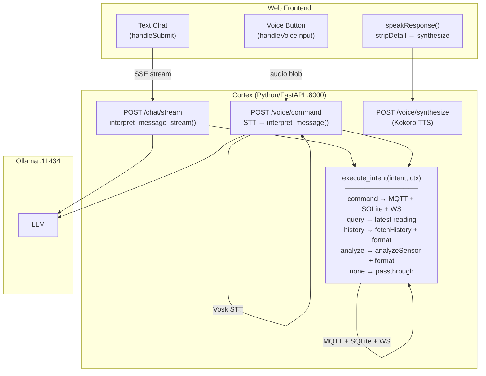

# Cortex Backend

Python/FastAPI unified backend: REST API, WebSocket, MQTT, MPC control, voice, LLM integration.

## Build & Run

```bash
python -m src.main                                              # Full backend (API + MQTT + voice)
uvicorn src.voice_api:app --host 0.0.0.0 --port 8000 --reload  # API server only (no MQTT)
```

## Testing

```bash
pytest tests/ -m "not e2e"  # Unit tests (no external services needed)
pytest tests/ -m e2e        # E2E tests (requires Mosquitto + Redis + Cortex running)
pytest tests/ -v            # All tests with verbose output
```

- Use shared fixtures from `conftest.py`: `sqlite_db`, `mock_redis`, `telemetry_factory`
- Name test classes `Test<Module>`, methods `test_<behavior_under_test>`
- E2E tests (`@pytest.mark.e2e`) require running services; keep unit tests fast with mocks

## Environment Variables

- `MQTT_HOST`, `MQTT_PORT` — MQTT broker config
- `REDIS_URL` — Redis connection
- `SQLITE_PATH`, `SQLITE_JOURNAL_MODE` — SQLite config
- `OLLAMA_URL`, `OLLAMA_MODEL` — Local LLM config
- `HTTP_PORT` — FastAPI server port (default: 8000)
- `RULES_PATH` — Path to rules.yaml (LLM config)
- `ROOM_CONFIG_PATH` — Path to room YAML for MPC
- `VOSK_MODEL_PATH` — Vosk STT model path
- `KOKORO_MODEL_PATH`, `KOKORO_VOICES_PATH` — Kokoro TTS model paths
- `KOKORO_VOICE`, `KOKORO_SPEED`, `KOKORO_LANG` — Kokoro TTS settings

## Architecture

### MPC Control

The control plane uses Model Predictive Control (MPC) via `MPCPlanner` + `PhysicsEngine`:
- `state_planner.py` — SLSQP optimizer with direct nonlinear shooting over a rolling horizon
- `PhysicsEngine` / `FastPhysicsEngine` — physics-based grow environment model as prediction model
- Cost function: weighted goal deviation + energy + actuator rate-of-change
- Light/CO2 schedule constraints, warm-start between solves
- See `simulations/CLAUDE.md` for full MPC and physics documentation

### Grow Profiles & Goals

- `cortex_profiles` table: per-location grow profiles with strategy (`precision`/`balanced`/`efficiency`) and growth phase (`seedling`/`veg`/`flower`/`late_flower`/`dry`/`cure`)
- `cortex_goals` table: per-profile metric goals with `range_min`/`range_max`, tolerance, priority, optional relay schedules
- Full CRUD via `/api/cortex/profiles` and `/api/cortex/profiles/{id}/goals`

### Derived Metrics

- `DerivedMetricEngine` computes VPD (Tetens equation from temp+humidity), dry-back rate (linear regression on soil moisture), and DLI (trapezoidal integration of light)
- Derived metrics are first-class sensors — goals can target them

### Ecosystem Health Scoring

- `EcosystemHealthScorer` computes weighted compliance across all goals for a location
- Strategy-adjusted tolerance multipliers: precision (1.0x), balanced (1.5x), efficiency (2.0x)
- Per-metric scores combined by priority weight into overall health (0-100)
- Snapshots persist to `cortex_health` table with per-metric breakdowns

### Voice & Chat Architecture

Both text chat and voice commands funnel through a shared `execute_intent()` function.



- TTS text cleaned via `_clean_text_for_tts()` in voice_service.py (numbers, times, currency, percentages, ordinals, emojis, markdown → spoken English)
- Long TTS text chunked via `_split_into_chunks()` to stay within Kokoro's 510 phoneme limit

### Generic Sensor Pipeline
- The entire telemetry pipeline is sensor-type agnostic — no hardcoded temp/humidity assumptions
- MQTT ingestion loops ALL numeric readings from device payloads into `readings: dict[str, float]`
- `sensor_meta.py` provides `guess_sensor_type()`, `sensor_unit()`, `sensor_label()` for sensor ID resolution
- `sensor_values` EAV table stores one row per sensor per timestamp (replaces fixed-column `sensor_readings`)

## Storage Strategy

- **Redis** — Raw readings with 48-hour TTL (HOT), stored as `{readings: {sensor_id: value}, ...}`
- **SQLite** — Aggregated historical data (COLD) in `sensor_values` EAV table
- `DataReader` merges both into `MergedReading(ts, readings: dict[str, float], device_id)`
- `cortex_baselines` — learned per-hour sensor baselines
- `cortex_outcomes` — command effectiveness scores
- `cortex_profiles` — per-location grow profiles with strategy and growth phase
- `cortex_goals` — per-profile metric goals with ranges, tolerance, priority, schedules
- `cortex_health` — periodic ecosystem health snapshots with per-metric breakdowns
- `cortex_effects` — learned per-actuator, per-sensor effect deltas (Welford's incremental stats)

## API Endpoints

**Telemetry & Analysis**
- `GET /api/latest` — Current sensor reading
- `GET /api/history` — Historical data (`sinceMs`, `untilMs`, `bucketMs`, `deviceId`)
- `GET /api/outcomes` — Command effectiveness records (`deviceId`, `target`, `sinceMs`, `limit`)

**Devices**
- `GET /api/devices` — Registered devices
- `GET /api/devices/:id` — Single device
- `GET /api/devices/:id/actuators` — Device actuators
- `PUT /api/devices/order` — Reorder devices (`{order: string[]}`)

**Relays (per-device)**
- `GET /api/devices/:deviceId/relays` — Device relay states
- `GET /api/devices/:deviceId/relays/:id` — Single relay
- `POST /api/devices/:deviceId/relays/:id` — Control relay state (`{state: boolean}`)
- `PATCH /api/devices/:deviceId/relays/:id` — Update relay name
- `DELETE /api/devices/:deviceId/relays/:id` — Delete relay

**Commands & Events**
- `GET /api/commands` — Command history
- `GET /api/events` — Device event log

**Observations**
- `POST /api/observations` — Log human observation (`{deviceId, category, notes?}`)

**Cortex Intelligence**
- `GET /api/cortex/status` — System intelligence overview

**Grow Profiles & Goals**
- `GET /api/cortex/profiles` — All grow profiles
- `GET /api/cortex/profiles/:id` — Single profile
- `POST /api/cortex/profiles` — Create profile (`{location, name, strategy, phase?, phaseStart?}`)
- `PUT /api/cortex/profiles/:id` — Update profile
- `DELETE /api/cortex/profiles/:id` — Delete profile
- `GET /api/cortex/profiles/:id/goals` — Goals for a profile (`?phase=`)
- `POST /api/cortex/profiles/:id/goals` — Create goal (`{metric, metricType, phase?, rangeMin?, rangeMax?, tolerance, priority, schedule?}`)
- `PUT /api/cortex/goals/:id` — Update goal
- `DELETE /api/cortex/goals/:id` — Delete goal

**Ecosystem Health & Effects**
- `GET /api/cortex/health/:location` — Health snapshots (`?sinceMs=&untilMs=`)
- `GET /api/cortex/effects` — Learned effect profiles (`?deviceId=&actuator=&minSamples=3`)

**Chat (NLP)**
- `POST /api/chat` — Process natural language command
- `POST /api/chat/stream` — Streaming chat response (SSE)
- `GET /api/chat/health` — Ollama availability check

**Voice (Direct)**
- `POST /api/voice/transcribe` — Audio → Text (Vosk STT)
- `POST /api/voice/synthesize` — Text → Audio (Kokoro TTS)
- `POST /api/voice/command` — Full STT → LLM → execute_intent pipeline

**WebSocket**
- WebSocket at `/ws` broadcasts:
  - `{type: "latest", data: ...}` — Sensor updates
  - `{type: "relays", data: ...}` — Relay state changes
  - `{type: "devices", data: ...}` — Device registry updates
  - `{type: "commands", data: ...}` — Command history
  - `{type: "events", data: ...}` — Device events

## Key Files

**Core Services:**
- `src/main.py` — Entry point: starts API server, MQTT
- `src/voice_api.py` — Unified FastAPI app (lifespan, routes, WebSocket, health)
- `src/config.py` — Environment variable configuration
- `src/services/sqlite_client.py` — SQLite schema, migrations, all CRUD queries
- `src/services/redis_client.py` — Redis client with 48hr TTL storage
- `src/services/mqtt_client.py` — MQTT subscriber/publisher with generic sensor ingestion
- `src/services/sensor_meta.py` — Sensor type resolution: `guess_sensor_type()`, `sensor_unit()`, `sensor_label()`
- `src/services/websocket_server.py` — WebSocket server + broadcast functions
- `src/services/ollama_client.py` — Ollama LLM client (chat intents)
- `src/services/intent_executor.py` — Shared intent executor for chat + voice routes
- `src/services/chat_session.py` — In-memory chat session store with TTL expiration
- `src/services/data_reader.py` — Unified Redis+SQLite telemetry read layer
- `src/services/background_jobs.py` — Aggregation + command expiration periodic jobs
- `src/services/derived_metrics.py` — VPD (Tetens), dry-back rate, DLI
- `src/services/ecosystem_health.py` — Weighted goal compliance with strategy tolerance
- `src/services/mpc_controller.py` — MPC controller integration
- `src/services/voice_service.py` — STT (Vosk) + TTS (Kokoro)
- `src/api/` — REST route handlers (telemetry, devices, relays, commands, events, observations, cortex, chat, voice)
- `config/rules.yaml` — LLM escalation config

**Test Files:**
- `tests/conftest.py` — Test fixtures (sqlite_db, mock_redis, telemetry_factory)
- `tests/test_cortex_api.py` — /api/cortex routes (status, profiles, goals)
- `tests/test_derived_metrics.py` — VPD calculation, dry-back rate, DLI integration
- `tests/test_ecosystem_health.py` — Health scoring, strategy tolerance, goal compliance
- `tests/test_grow_profiles.py` — Profile/goal CRUD, phase validation
- `tests/test_chat_session.py` — Chat session store, TTL expiration
- `tests/test_data_reader.py` — Redis+SQLite merge layer
- `tests/test_observations.py` — Observation endpoint validation, storage, broadcast
- `tests/test_sensor_values.py` — sensor_values EAV table CRUD, bucketing, migration
- `tests/test_sensor_meta.py` — Sensor type guessing, unit/label resolution
- `tests/test_fast_physics.py` — FastPhysicsEngine: SVP lookup, direction tests, benchmarks, regression
- `tests/test_fast_physics_mpc.py` — MPC solve with FastPhysicsEngine, trajectory, run_mpc integration
- `tests/test_simulation_mpc.py` — MPC runner, energy tracking, compliance, chart generation
- `tests/test_simulation_multi_day.py` — Ambient schedule, multi-day runner, convergence
- `tests/test_state_planner.py` — MPCConfig, cost functions, solver convergence, warm start
- `tests/test_duct_physics.py` — System resistance, fan operating point, ACH, unit conversions
- `tests/test_substrate_physics.py` — Substrate presets, geometry, evap modifier, stress, irrigation
- `tests/test_room_config.py` — YAML loading, validation, ventilation/substrate parsing
- `tests/test_mpc_controller.py` — MPC controller integration tests
- `tests/test_e2e_flow.py` — E2E: MQTT→API→Storage flow (requires running services)
