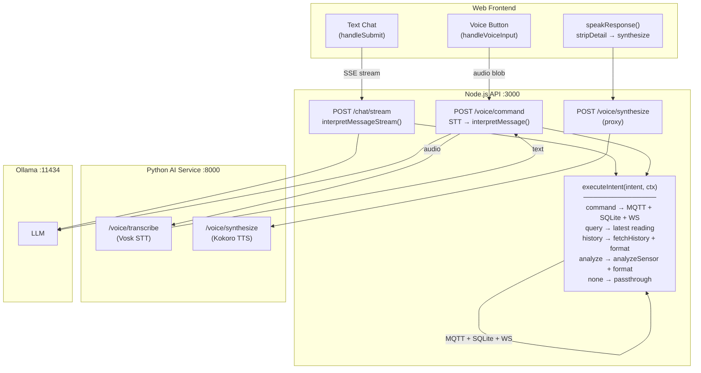

# Unify voice and text chat flows

**Status: COMPLETE**

## Context

Voice (`POST /api/voice/command`) and text chat (`POST /api/chat/stream`) previously took different code paths with different capabilities. The goal was to make voice use the same backend flow as text chat so all intents are handled identically.

## Previous differences (resolved)

| Aspect | Text chat | Voice | Status |
|--------|-----------|-------|--------|
| **History intent** | Executes `fetchHistory()` + `formatHistoryReply()` | Was returning raw `intent.reply` only | Fixed |
| **Analyze intent** | Executes `analyzeSensorData()` + `formatAnalysisReply()` | Was returning raw `intent.reply` only | Fixed |
| **Command intent** | Full: MQTT publish + SQLite insert + WS broadcast | Same | Already worked |
| **Query intent** | Full: reads latest sensor value | Same | Already worked |

**Root cause was:** `voice.ts` — history/analyze/none intents fell through to a generic response that only returned `intent.reply` without executing the intent.

## Architecture

All routes funnel through `executeIntent()` — the single place where intents map to side effects. Python AI service is reduced to pure STT/TTS utilities (dead endpoints removed).

## Implementation (completed)

### 1. Created `apps/api/src/routes/utils/executeIntent.ts` — DONE

Shared intent executor handling all 5 intent types:
- **command** — `publishCommand()` + `insertCommand()` + `broadcastCommand()`
- **query** — `getLatestByDevice()` → per-device sensor value
- **history** — `fetchHistory()` + `formatHistoryReply()`
- **analyze** — `analyzeSensorData()` + `formatAnalysisReply()`
- **none** — passthrough

Also includes `resolveDevice()` helper that prefers LLM's `deviceId`, then context's, then fallback — enabling multi-device targeting from chat/voice.

### 2. Refactored `apps/api/src/routes/chat.ts` — DONE

Both `POST /` and `POST /stream` now call `executeIntent()` instead of inline if/else chains.

### 3. Refactored `apps/api/src/routes/voice.ts` — DONE

`POST /command` now calls `executeIntent()`. Dead `POST /command/audio` endpoint removed.

### 4. Cleaned up Python `apps/ai/src/api.py` — DONE

Removed dead endpoints (`/voice/command`, `/voice/command/audio`, `/chat`), `_process_with_llm()`, `VoiceCommandResponse`, and `ChatResponse` models. Kept `ChatRequest` (used by `/voice/synthesize`). Only active endpoints remain: `/voice/transcribe`, `/voice/synthesize`, `/health`.

### 5. No frontend changes needed — CONFIRMED

Voice responses now contain the full formatted reply (with `<detail>` tags) just like text chat. Existing `stripDetail()` and `formatMessage()` handle display/TTS separation.

### 6. Multi-device targeting (follow-up enhancement)

While implementing, also added multi-device targeting support:
- `OllamaIntent` type now includes optional `deviceId` on all intent variants
- System prompt (`systemPrompt.ts`) now lists per-device sensor readings and instructs the LLM to include `deviceId`
- `executeIntent()` uses `resolveDevice()` to resolve the correct device from LLM output, context, or fallback

## Files modified

| File | Change | Commit |
|------|--------|--------|
| `apps/api/src/routes/utils/executeIntent.ts` | **New** — shared intent executor with `resolveDevice()` | `6bbbe75` |
| `apps/api/src/routes/chat.ts` | Replaced inline intent logic with `executeIntent()` | `6bbbe75` |
| `apps/api/src/routes/voice.ts` | Replaced inline intent logic with `executeIntent()`, removed dead endpoint | `6bbbe75` |
| `apps/ai/src/api.py` | Removed dead endpoints, kept STT/TTS utilities | `6bbbe75` |
| `apps/api/src/services/ollama.ts` | Added optional `deviceId` to `OllamaIntent` variants | follow-up |
| `apps/api/src/services/systemPrompt.ts` | Per-device readings, `deviceId` in intent schemas | follow-up |