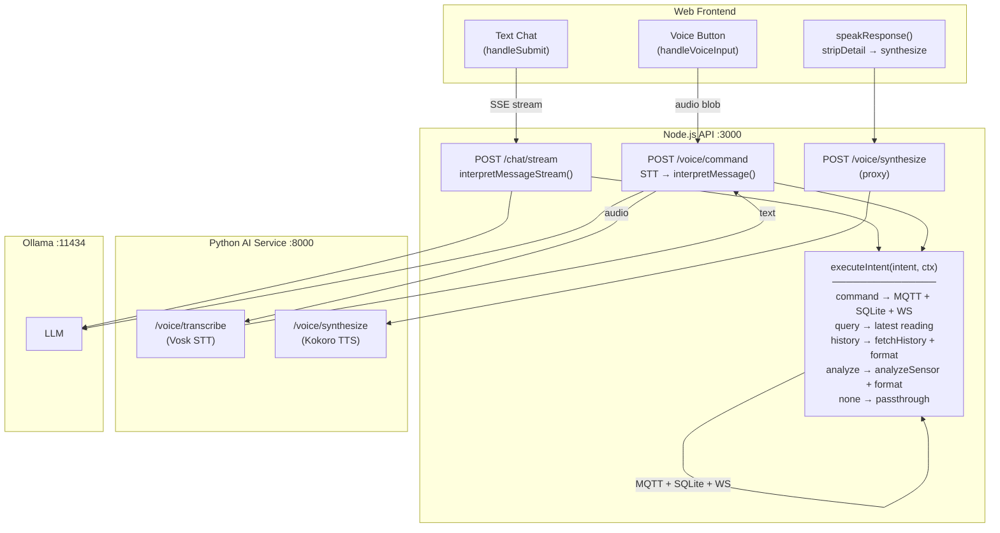

# Unify voice and text chat flows

**Status: COMPLETE**

## Context

Voice (`POST /api/voice/command`) and text chat (`POST /api/chat/stream`) previously took different code paths with different capabilities. The goal was to make voice use the same backend flow as text chat so all intents are handled identically.

## Previous differences (resolved)

| Aspect | Text chat | Voice | Status |
|--------|-----------|-------|--------|
| **History intent** | Executes `fetchHistory()` + `formatHistoryReply()` | Was returning raw `intent.reply` only | Fixed |
| **Analyze intent** | Executes `analyzeSensorData()` + `formatAnalysisReply()` | Was returning raw `intent.reply` only | Fixed |
| **Command intent** | Full: MQTT publish + SQLite insert + WS broadcast | Same | Already worked |
| **Query intent** | Full: reads latest sensor value | Same | Already worked |

**Root cause was:** `voice.ts` — history/analyze/none intents fell through to a generic response that only returned `intent.reply` without executing the intent.

## Architecture



All routes funnel through `executeIntent()` — the single place where intents map to side effects. Python AI service is reduced to pure STT/TTS utilities (dead endpoints removed).

## Plan

Extract a shared `executeIntent()` function so all routes (chat `/`, chat `/stream`, voice `/command`) call the same code. Also remove dead `/command/audio` endpoint from Node's `voice.ts`.

### 1. Create `apps/api/src/routes/utils/executeIntent.ts`

Extract the intent switch logic that is currently copy-pasted across `chat.ts` and `voice.ts` into a single function:

```typescript
import type { OllamaIntent } from "../../services/ollama.js";

type IntentContext = {
  deviceId?: string;
  location?: string;
  source: "chat" | "voice";
  message: string;
};

type IntentResult = {
  ok: boolean;
  reply: string;
  action?: { type: string; [key: string]: unknown };
};

export async function executeIntent(
  intent: OllamaIntent,
  ctx: IntentContext
): Promise<IntentResult>;
```

The function handles all 5 intent types:
- **command** — `publishCommand()` + `insertCommand()` + `broadcastCommand()`, returns `{ok, reply, action: {type:"command", correlationId, target, value}}`
- **query** — `getLatest()` → sensor value, returns `{ok, reply, action: {type:"query", sensor, value}}`
- **history** — `fetchHistory()` + `formatHistoryReply()`, returns `{ok, reply, action: {type:"history", timeframe, category, commands, events}}`
- **analyze** — `analyzeSensorData()` + `formatAnalysisReply()`, returns `{ok, reply, action: {type:"analyze", timeframe, metric, analysis}}`
- **none** — returns `{ok, reply}`

Imports needed: `publishCommand`, `insertCommand`, `broadcastCommand`, `getLatest`, `fetchHistory`, `formatHistoryReply`, `analyzeSensorData`, `formatAnalysisReply`

### 2. Refactor `apps/api/src/routes/chat.ts`

Replace the inline intent switch in both `POST /` and `POST /stream` with calls to `executeIntent()`:

- **`POST /`** (~lines 26-147): replace the if/else chain with:
  ```typescript
  const result = await executeIntent(intent, { deviceId, location, source: "chat", message });
  res.json(result);
  ```
  Special case: command intent when MQTT is disconnected (`!correlationId`) returns 503. Move this into `executeIntent` by having it return `{ok: false, reply: "...", error: "MQTT client not connected"}` and let the caller check `result.ok` to set status code.

- **`POST /stream`** (~lines 190-313): after streaming completes and `intent` is available, replace the if/else chain with:
  ```typescript
  const result = await executeIntent(intent, { deviceId, location, source: "chat", message });
  res.write(`data: ${JSON.stringify({ type: "done", ...result })}\n\n`);
  ```

### 3. Refactor `apps/api/src/routes/voice.ts`

- **`POST /command`** (~lines 128-196): replace the if/else chain with:
  ```typescript
  const result = await executeIntent(intent, { deviceId, location, source: "voice", message: transcription.text });
  res.json({ ok: result.ok, transcription: transcription.text, response: result.reply, action: result.action?.type, target: result.action?.target, value: result.action?.value });
  ```

- **Remove `POST /command/audio`** (~lines 206-294): dead code — nothing in the frontend or elsewhere calls it

### 4. Clean up dead Python endpoints in `apps/ai/src/api.py`

Remove unused endpoints and helpers that are dead code (web frontend never calls them):

- **Remove** `POST /voice/command` (line 154-194) — web frontend uses Node's `/api/voice/command` instead
- **Remove** `POST /voice/command/audio` (line 197-235) — same reason
- **Remove** `POST /chat` (line 238-257) — unused
- **Remove** `_process_with_llm()` (line 260-284) — only used by the removed endpoints
- **Remove** `VoiceCommandResponse` model (line 90-95) — only used by removed endpoint
- **Remove** `ChatResponse` model (line 83-87) — only used by removed endpoint
- **Keep** `/voice/transcribe`, `/voice/synthesize`, `/health` — actively used as STT/TTS utilities

### 5. No frontend changes needed

- `handleVoiceInput()` already displays `result.response` as the assistant message content
- `speakResponse(stripDetail(result.response))` already strips `<detail>` tags before TTS
- `formatMessage()` already strips `<detail>`/`</detail>` markers for display
- Voice responses will now contain the full formatted reply just like text chat

## Files to modify

| File | Change |
|------|--------|
| `apps/api/src/routes/utils/executeIntent.ts` | **New** — shared intent executor |
| `apps/api/src/routes/chat.ts` | Replace inline intent logic in both handlers with `executeIntent()` |
| `apps/api/src/routes/voice.ts` | Replace inline intent logic in both handlers with `executeIntent()` |
| `apps/ai/src/api.py` | Remove dead endpoints: `/voice/command`, `/voice/command/audio`, `/chat`, `_process_with_llm()` |

## Verification

1. `cd apps/api && npx tsc --noEmit` — type check
2. Manual test text chat: "turn on the light", "what's the temperature?", "what happened today?", "analyze temperature" — all should work as before
3. Manual test voice: "what happened in the last hour?" — should now return formatted history with `<detail>` block, TTS speaks intro + summary
4. Manual test voice: "analyze temperature" — should now return formatted analysis with stats/anomalies
5. Manual test voice: "turn on the light" — should still work as before
6. Verify Python service still works: `curl -X POST http://localhost:8000/voice/synthesize -H "Content-Type: application/json" -d '{"message":"hello"}'` — should return WAV audio